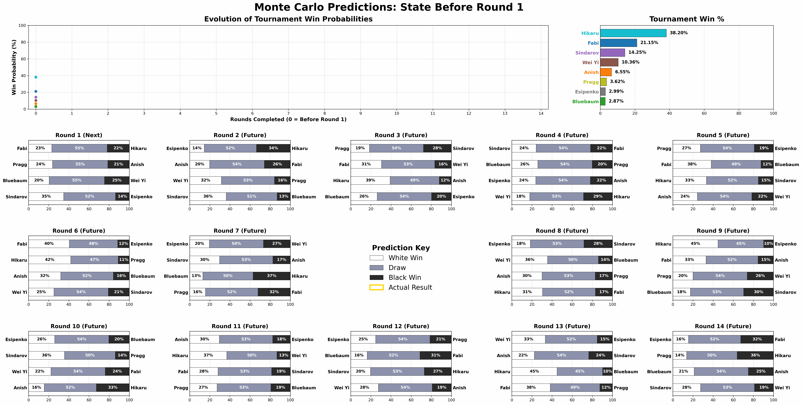
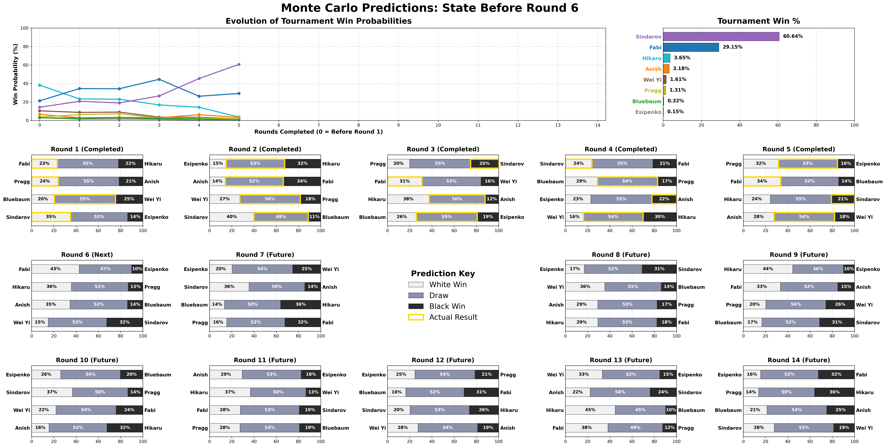
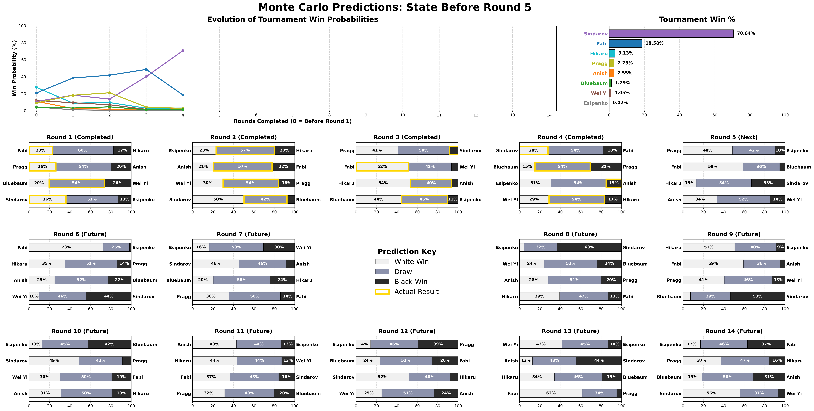
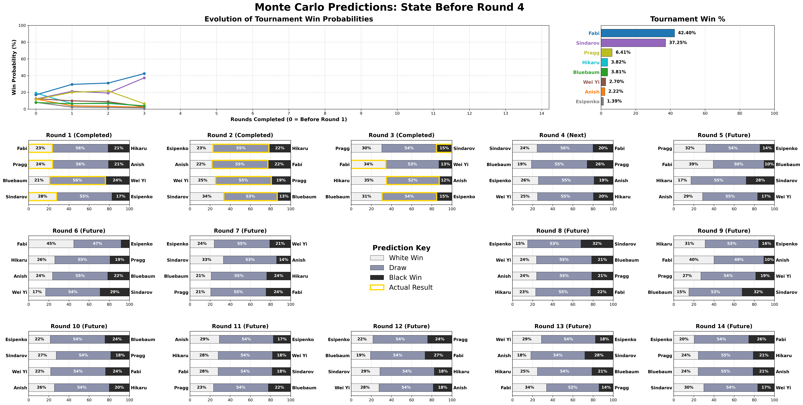
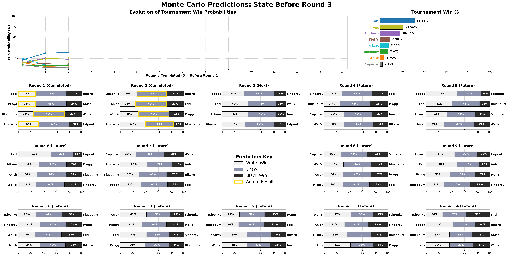
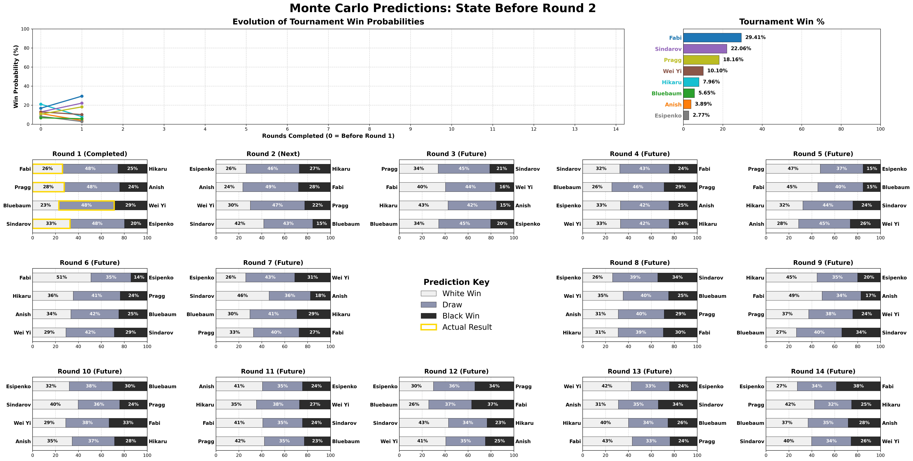
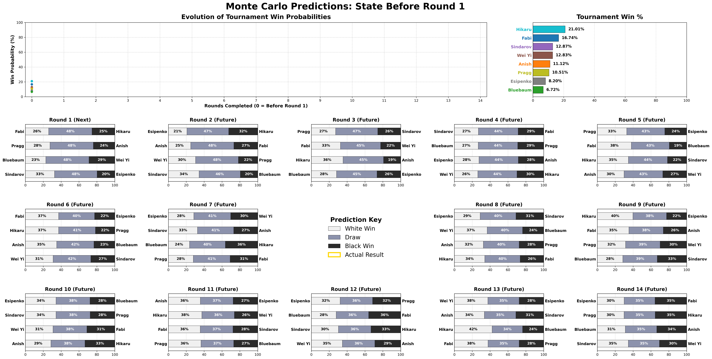

# Chess Monte Carlo Simulation

A multi-threaded Monte Carlo simulator for 8-player round-robin chess tournaments. Models dynamic per-player ratings that update as games are played, then runs millions of simulated completions to estimate win probabilities.

The included `tournament.json` models the **2026 FIDE Candidates Tournament** (Caruana, Nakamura, Giri, Yi Wei, Sindarov, Praggnanandhaa, Esipenko, Bluebaum).

## Animated GIF



Run `make_gif.py` to combine all round PNGs in `results/` into `results/animation.gif`.

```
python3 make_gif.py
```

## Visualizations

<!-- Add new rounds here (most recent first): copy the <details> block and update the round number and image path -->

<details>
<summary>Round 6</summary>



</details>

<details>
<summary>Round 5</summary>



</details>

<details>
<summary>Round 4</summary>



</details>

<details>
<summary>Round 3</summary>



</details>

<details>
<summary>Round 2</summary>



</details>

<details>
<summary>Round 1</summary>



</details>

## Features

- **Dynamic Bayesian ratings** — a 2N anchored MAP estimator maintains separate White and Black latent strengths per player, updated every round
- **Parametric draw model** — draw probability proportional to ν·√(λW·λB), where ν is a time-control-specific tuning parameter (`classical_nu`, `rapid_nu`, `blitz_nu`)
- **Overpush mechanics** — each player has separate White/Black aggression scores (fraction of decisive games as White/Black); when both players are likely to take risks, ν is reduced (more decisive games), scaled by round urgency
- **Streak modifier** — players on a winning streak become more aggressive; players on a losing streak become more cautious (scaled by `streak_aggression_mod`); draws reset the streak
- **Leader caution** — the tournament leader's aggression is reduced by `leader_caution_penalty`, modeling conservative play when protecting a lead
- **Color bleed** — aggression and rating form cross-pollinate between colors: a player's White aggression is informed slightly by their Black results and vice versa; λW/λB are also geometrically blended after each MAP update and rescaled to prevent drift
- **Time control support** — uses Classical, Rapid, or Blitz ratings for the appropriate stage
- **FIDE 2026 playoff rules** — tiebreaks follow the official Rapid → Blitz → Sudden-death knockout sequence (Regulation 4.4.2)
- **Parallel simulation** — work is distributed across all hardware threads via `std::thread`

## Build

```bash
g++ -O3 -march=native -std=c++17 -pthread chess_montecarlo.cpp -o chess_montecarlo
```

Requires a C++17-capable compiler. The only dependency is [`json.hpp`](https://github.com/nlohmann/json) (included).

## Usage

```bash
./chess_montecarlo [tournament.json] [simulate_from_round]
```

Defaults to `tournament.json` in the current directory. The optional second argument overrides `simulate_from_round` from the JSON. Output is printed to stdout.

Redirect to a file to feed into the visualizer:

```bash
./chess_montecarlo tournament.json > results/rounds/round5.txt
```

## Tournament JSON format

```jsonc
{
  "runs": 10000000,              // number of Monte Carlo iterations
  "simulate_from_round": 3,      // rounds before this are treated as known history

  // Model hyperparameters (all optional — defaults shown)
  "prior_weight": 1.0,           // MAP prior strength anchoring ratings to initial values
  "initial_white_adv": 35.0,     // Elo points of White advantage split ±17.5 per side
  "classical_nu": 2.5,           // draw rate scaling for classical games
  "rapid_nu": 1.5,               // draw rate scaling for rapid tiebreaks
  "blitz_nu": 0.8,               // draw rate scaling for blitz tiebreaks
  "overpush_escalation": 0.02,   // per-round urgency multiplier on overpush probability
  "overpush_nu_multiplier": 0.20,// nu is multiplied by this when overpush triggers
  "agg_prior_weight": 4.0,       // prior strength for per-player aggression estimates
  "default_aggression_w": 0.25,  // prior decisive-game fraction as White
  "default_aggression_b": 0.15,  // prior decisive-game fraction as Black
  "streak_aggression_mod": 0.03, // aggression delta per consecutive win/loss in streak
  "leader_caution_penalty": 0.05,// aggression reduction applied to the tournament leader
  "color_bleed": 0.10,           // cross-pollination factor between White/Black form & aggression
  "map_iters": 100,              // max MAP fixed-point iterations per round update
  "map_tolerance": 1e-8,         // convergence threshold for MAP iteration

  "players": [
    {
      "fide_id": 2020009,
      "name": "Caruana, Fabiano",
      "rating": 2793,
      "rapid_rating": 2727,      // optional, falls back to rating
      "blitz_rating": 2749,      // optional, falls back to rating
      "aggression_w": 0.25,      // optional, prior decisive-game fraction as White
      "aggression_b": 0.15       // optional, prior decisive-game fraction as Black
    }
    // ... 7 more players (exactly 8 required)
  ],
  "schedule": [
    { "white": 2020009, "black": 2016192, "result": "1-0"     }, // known game
    { "white": 2020009, "black": 2016192, "result": "1/2-1/2" }, // known game
    { "white": 2020009, "black": 2016192 }                       // future game (no result)
  ]
}
```

Games are grouped into rounds of 4 (`N/2`). Games before `simulate_from_round` must have a `result`; games from that round onward are simulated.

## Visualization

Requires Python with `matplotlib`, `pandas`, and `numpy`.

```bash
python visualize_timeline.py results/rounds/
```

Reads all `round{N}.txt` files in the given directory and produces a dashboard PNG showing:

- Win probability timeline across rounds
- Current win % bar chart
- Per-round match prediction breakdowns (with actual results highlighted in gold)

```bash
python visualize_timeline.py results/rounds/ -o my_output.png  # custom output path
python visualize_timeline.py results/rounds/ -k 5              # only show up to round 5
```

Output is saved as `round{N}.png` in the input directory by default.

## How the model works

Each player has two latent strengths: λW (White) and λB (Black). Before any games are played, these are initialized from the FIDE classical rating ± 17.5 Elo (half of `initial_white_adv`).

After each round, the simulator updates λW and λB in three steps:

1. **MAP fixed-point iteration** — solves the anchored Bradley-Terry MAP equations given all games played so far. The prior pulls each λ back toward its initial value (strength controlled by `prior_weight`). Early upsets shift the posterior, revising expectations for future rounds.

2. **Geometric form blending (color bleed)** — a player's relative form as White (λW / λW₀) is blended with their relative form as Black (λB / λB₀), and vice versa, using a weighted geometric mean controlled by `color_bleed`. This lets a player who has been performing well in general also benefit slightly across both colors.

3. **Population rescaling** — the geometric mean of all λ values is kept equal to the initial baseline, preventing floating-point drift over many rounds.

Win and draw probabilities for a game between White player w and Black player b are:

```
p_win  = λW[w] / Z
p_draw = ν · √(λW[w] · λB[b]) / Z
p_loss = λB[b] / Z
```

where Z is the normalizing sum and ν is the time-control draw-rate parameter.

**Overpush mechanic:** before each classical game, the model assembles an effective aggression score for each player:

1. Start from the Bayesian-smoothed decisive-game fraction for that color, cross-pollinated via `color_bleed` with the other color's estimate.
2. Add `streak × streak_aggression_mod` — a winning streak (positive) raises aggression; a losing streak (negative) lowers it. A draw resets the streak to zero.
3. Subtract `leader_caution_penalty` if the player is currently at or above the maximum points in the standings.
4. Clamp to [0, 1].

The average aggression of both players, scaled by a round-urgency factor (1 + `overpush_escalation` × (round − 1)), gives a probability that both players will "overpush." When overpush triggers, ν is multiplied by `overpush_nu_multiplier`, sharply reducing draw probability to model high-stakes decisive play.
