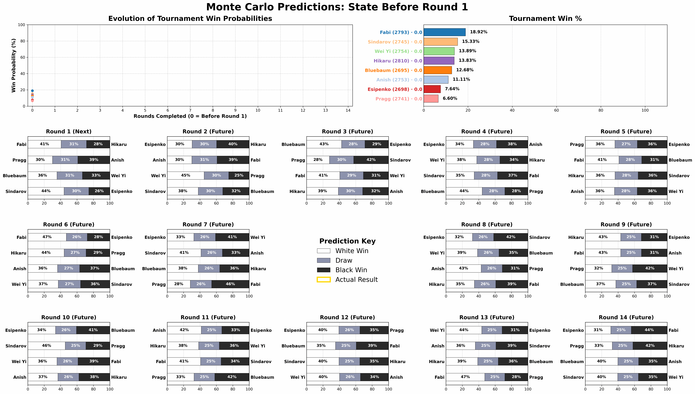
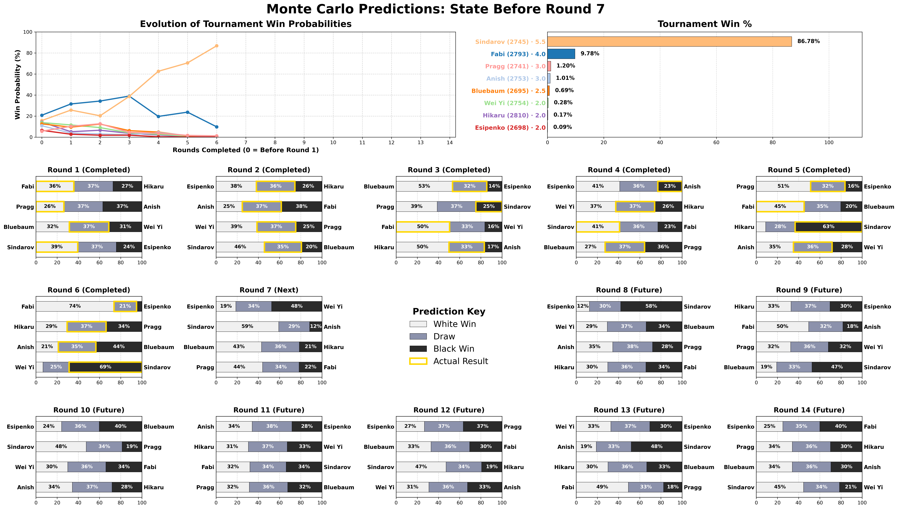
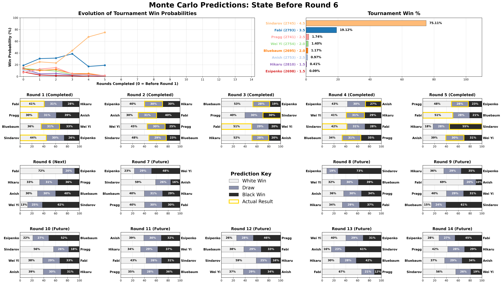
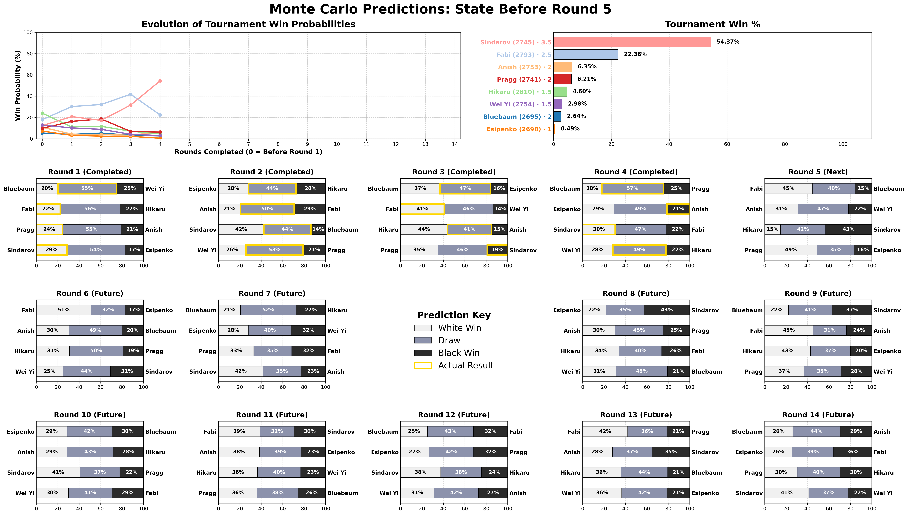
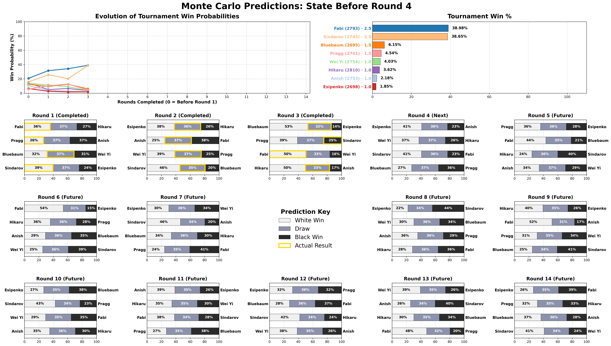
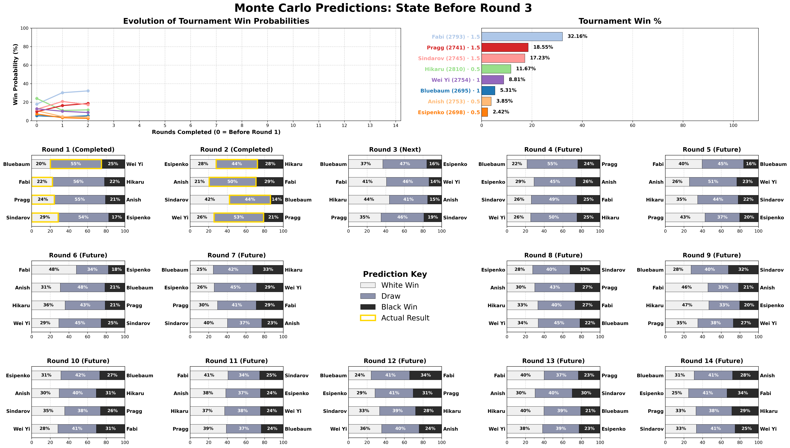
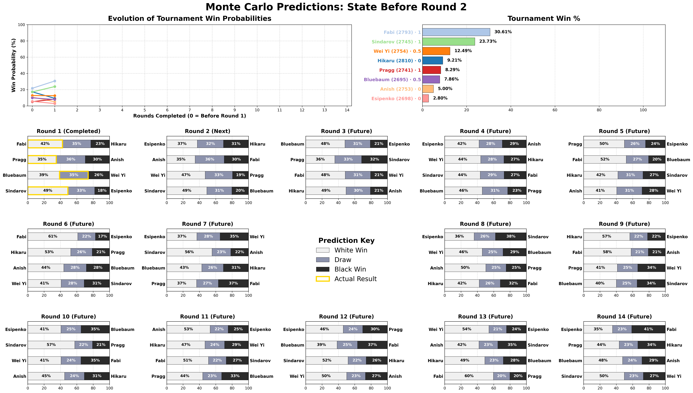
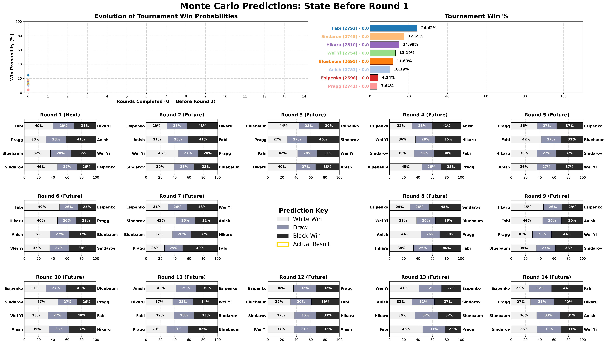

# Chess Monte Carlo Simulation

A multi-threaded Monte Carlo simulator for 8-player round-robin chess tournaments. Models dynamic per-player ratings that update as games are played, then runs millions of simulated completions to estimate win probabilities.

The included `data/candidates2026.json` holds the true data of the **2026 FIDE Candidates Tournament**.

## Repository Layout

```
src/                     C++ source and bundled json.hpp header
bin/                     Compiled binary (chess_montecarlo)
configs/                 hyperparameters.json and tuning snapshots
data/                    Tournament JSON files and raw PGN downloads
  raw/                   Raw PGN broadcasts downloaded from Lichess
results/                 Per-tournament visualizations and simulation outputs
  candidates2026/
    rounds/              round{N}.txt simulation outputs
    r{N}.png             Per-round bar charts
    animation.gif        Animated GIF of all rounds
scripts/                 Python helper scripts
  build_tournament.py    Build tournament.json from a Lichess broadcast
  visualize_timeline.py  Generate dashboard PNGs from round outputs
  make_gif.py            Combine round PNGs into an animated GIF
  pareto_front.py        Visualize Optuna Pareto front and print best trials
db/                      Optuna SQLite databases for hyperparameter tuning
tune.py                  Optuna hyperparameter search driver
install.sh               Dependency installation snippet
```

## Animated GIF



Run `scripts/make_gif.py` to combine all round PNGs into an animated GIF.

```bash
python3 scripts/make_gif.py results/candidates2026/

# Custom output path
python3 scripts/make_gif.py results/candidates2026/ -o results/candidates2026/animation.gif

# Custom frame durations (ms)
python3 scripts/make_gif.py results/candidates2026/ -d 3000 --last-duration 10000
```

## Visualizations

<!-- Add new rounds here (most recent first): copy the <details> block and update the round number and image path -->

<details>
<summary>Round 7</summary>



</details>

<details>
<summary>Round 6</summary>



</details>

<details>
<summary>Round 5</summary>



</details>

<details>
<summary>Round 4</summary>



</details>

<details>
<summary>Round 3</summary>



</details>

<details>
<summary>Round 2</summary>



</details>

<details>
<summary>Round 1</summary>



</details>

## Features

- **Dynamic Bayesian ratings** — a 2N anchored MAP estimator maintains separate White and Black latent strengths per player, updated every round
- **Parametric draw model** — draw probability proportional to ν·√(λW·λB), where ν is a time-control-specific tuning parameter (`classical_nu`, `rapid_nu`, `blitz_nu`)
- **Style multiplier** — each player has Bayesian-smoothed White/Black aggression scores (fraction of decisive games); ν is scaled by `baselineAgg / matchAgg`, shrinking the draw band when both players play sharply and inflating it when they play solidly
- **Standings multiplier** — players further behind the leader are more desperate; ν is additionally scaled by `max(0.4, 1 − standings_aggression × combinedDeficit)`, where `combinedDeficit` is the sum of both players' point gaps to the leader
- **Color bleed** — aggression and rating form cross-pollinate between colors: a player's White aggression is informed slightly by their Black results and vice versa; λW/λB are also geometrically blended after each MAP update and rescaled to prevent drift
- **Velocity projection** — per-player rating trends across all three time controls are estimated via time-decayed weighted least-squares regression; projected ratings initialize λW/λB, with rapid/blitz deltas blended in via `rapid_form_weight` and `blitz_form_weight`
- **Time control support** — uses Classical, Rapid, or Blitz ratings for the appropriate stage
- **FIDE 2026 playoff rules** — tiebreaks follow the official Rapid → Blitz → Sudden-death knockout sequence (Regulation 4.4.2)
- **Parallel simulation** — work is distributed across all hardware threads via `std::thread`

## Build

```bash
g++ -O3 -march=native -std=c++17 -pthread src/chess_montecarlo.cpp -o bin/chess_montecarlo
```

Requires a C++17-capable compiler. The only dependency is [`json.hpp`](https://github.com/nlohmann/json) (included in `src/`).

## Usage

```bash
./bin/chess_montecarlo [hyperparameters.json] [tournament.json] [simulate_from_round]
```

Both files default to their names in the current directory. `simulate_from_round` must be passed as a CLI argument. Output is printed to stdout.

Redirect to a file to feed into the visualizer:

```bash
./bin/chess_montecarlo configs/hyperparameters.json data/candidates2026.json 8 > results/candidates2026/rounds/round8.txt
```

## JSON format

### `configs/hyperparameters.json`

```jsonc
{
  // ── Simulation ───────────────────────────────────────────────────────────
  "runs": 1000000,
  "map_iters": 100,
  "map_tolerance": 1e-8,

  // ── MAP prior weights ────────────────────────────────────────────────────
  "prior_weight": 1.0,           // sets both known and sim; override individually below
  "prior_weight_known": 0.5,
  "prior_weight_sim": 2.0,

  // ── Rating initialization & velocity ────────────────────────────────────
  "initial_white_adv": 35.0,     // Elo points of White advantage split ±17.5 per side
  "velocity_time_decay": 0.95,
  "lookahead_factor": 1.0,

  // ── Cross-time-control blending ──────────────────────────────────────────
  "rapid_form_weight": 0.25,
  "blitz_form_weight": 0.15,
  "color_bleed": 0.20,

  // ── Draw model ───────────────────────────────────────────────────────────
  "classical_nu": 2.5,
  "rapid_nu": 1.5,
  "blitz_nu": 0.8,

  // ── Aggression & overpush ────────────────────────────────────────────────
  "agg_prior_weight": 3.0,
  "default_aggression_w": 0.30,
  "default_aggression_b": 0.10,
  "standings_aggression": 0.15
}
```

### `data/candidates2026.json`

```jsonc
{
  "players": [
    {
      "fide_id": 2020009,
      "name": "Caruana, Fabiano",
      "rating": 2793,
      "rapid_rating": 2727,             // optional, falls back to rating
      "blitz_rating": 2749,             // optional, falls back to rating
      "aggression_w": 0.25,             // optional, prior decisive-game fraction as White
      "aggression_b": 0.15,             // optional, prior decisive-game fraction as Black
      "history": [2780, 2790, 2793],    // optional, classical rating history for velocity (oldest → newest)
      "games_played": [10, 12, 11],     // optional, game counts per history entry (used as weights)
      "rapid_history": [2720, 2727],    // optional, rapid rating history
      "rapid_games_played": [8, 9],     // optional, rapid game counts per history entry
      "blitz_history": [2740, 2749],    // optional, blitz rating history
      "blitz_games_played": [15, 14]    // optional, blitz game counts per history entry
    }
    // ... 7 more players (exactly 8 required)
  ],
  "schedule": [
    { "white": 2020009, "black": 2016192, "result": "1-0"     }, // known game
    { "white": 2020009, "black": 2016192, "result": "1/2-1/2" }, // known game
    { "white": 2020009, "black": 2016192 }                       // future game (no result)
  ]
}
```

Games are grouped into rounds of 4 (`N/2`). Games with a `result` are treated as known history up to `simulate_from_round` (passed via CLI); games from that round onward are simulated.

## Building tournament data

`scripts/build_tournament.py` downloads games from a Lichess broadcast, fetches FIDE rating history, and writes a ready-to-use tournament JSON file.

```bash
pip install requests python-chess

# Build from a Lichess broadcast ID or URL
python scripts/build_tournament.py wEuVhT9c -o data/my_tournament.json

# Slice FIDE history to a specific month 
python scripts/build_tournament.py wEuVhT9c --as-of 2024-04 -o data/candidates2024.json

# Skip FIDE history fetch (uses ratings from PGN headers only)
python scripts/build_tournament.py wEuVhT9c --no-fide

# Control how many monthly history periods to fetch (default: 6)
python scripts/build_tournament.py wEuVhT9c --periods 8
```

## Hyperparameter tuning

`tune.py` uses [Optuna](https://optuna.org) to search for the best model parameters.

```bash
pip install optuna

# Run 200 trials (always resumes an existing study automatically)
python tune.py configs/hyperparameters.json data/candidates2024.json

# Fewer trials
python tune.py configs/hyperparameters.json data/candidates2024.json --trials 50

# Custom binary or database path
python tune.py configs/hyperparameters.json data/candidates2024.json \
    --binary ./bin/chess_montecarlo \
    --db db/tuning_2024.db
```

**Evaluation strategy — multi-objective progressive round scoring:** for each round K with known results, the binary is run with `simulate_from_round = K` so rounds 1…K−1 are treated as history and rounds K onward are the held-out predictions. Two independent objectives are minimized simultaneously:

1. **Weighted Game Brier Score** — multi-class Brier score (`(pw − actual_w)² + (pd − actual_d)² + (pb − actual_b)²`) over all predicted games, decay-weighted by `FUTURE_DECAY_WEIGHT^distance` for games further in the future. Decisive outcomes (wins/losses) are up-weighted by `DECISIVE_GAME_WEIGHT` to combat the lazy-draw problem. Each round's score is normalized by its own weight sum, then averaged uniformly across all simulation points.

2. **Winner Brier Score** — Brier score over tournament win probability predictions, averaged uniformly across all simulation points.

Both objectives are averaged across simulation points **weighted by round number**: a prediction error at round 13 counts 13× more than one at round 1, reflecting that you should be increasingly accurate as more results are known.

Optuna returns a **Pareto front** of trials offering unique trade-offs between the two objectives. `EVAL_RUNS` at the top of the script controls Monte Carlo iterations per trial (default 10 000 — fast; raise to 200 000+ for a final search).

Results are stored in `db/`. To inspect the Pareto front:

```bash
# Interactive scatter plot + console table (defaults to db/tuning_2024.db, study chess_montecarlo)
python scripts/pareto_front.py

# Custom database or study name
python scripts/pareto_front.py db/tuning_2024.db chess_montecarlo

# Save plot to file instead of showing it
python scripts/pareto_front.py --save results/pareto.png
```

The plot shows all completed trials as blue-gradient dots (darker = earlier trial), Pareto-optimal trials as highlighted points connected by a staircase line, and each optimal trial's number as a label. The console table prints all 15 parameters for each Pareto-optimal trial, sorted by combined objective score.

## Visualization

Requires Python with `matplotlib`, `pandas`, and `numpy`.

```bash
python scripts/visualize_timeline.py results/candidates2026/rounds/
```

Reads all `round{N}.txt` files in the given directory and produces a dashboard PNG showing:

- Win probability timeline across rounds
- Current win % bar chart
- Per-round match prediction breakdowns (with actual results highlighted in gold)

```bash
python scripts/visualize_timeline.py results/candidates2026/rounds/ -o my_output.png  # custom output path
python scripts/visualize_timeline.py results/candidates2026/rounds/ -k 5              # only show up to round 5
```

Output is saved as `round{N}.png` in the input directory by default.

## How the model works

Each player has two latent strengths: λW (White) and λB (Black). Before any games are played, these are initialized from a projected rating derived from FIDE ratings ± 17.5 Elo (half of `initial_white_adv`).

**Rating velocity and form anchor:** if a player has rating history entries (`history`, `rapid_history`, `blitz_history`), the simulator fits a time-decayed weighted least-squares slope to estimate a velocity (rating points per period). The initial λW/λB are anchored to `projC + speedAdj`, where `projC = classical_rating + velC × lookahead_factor` and `speedAdj = rapid_form_weight × (projR − projC) + blitz_form_weight × (projB − projC)`. This lets rapid and blitz trends inform the classical form anchor.

After each round, the simulator updates λW and λB in three steps:

1. **MAP fixed-point iteration** — solves the anchored Bradley-Terry MAP equations given all games played so far. The prior pulls each λ back toward its initial value (strength controlled by `prior_weight_known` for historical rounds, `prior_weight_sim` for simulated rounds). Early upsets shift the posterior, revising expectations for future rounds.

2. **Geometric form blending (color bleed)** — a player's relative form as White (λW / λW₀) is blended with their relative form as Black (λB / λB₀), and vice versa, using a weighted geometric mean controlled by `color_bleed`. This lets a player who has been performing well in general also benefit slightly across both colors.

3. **Population rescaling** — the geometric mean of all λ values is kept equal to the initial baseline, preventing floating-point drift over many rounds.

Win and draw probabilities for a game between White player w and Black player b are:

```
p_win  = λW[w] / Z
p_draw = ν · √(λW[w] · λB[b]) / Z
p_loss = λB[b] / Z
```

where Z is the normalizing sum and ν is the time-control draw-rate parameter.

**Draw band scaling:** before each classical game, ν is scaled by two independent multipliers:

1. **Style multiplier** — `baselineAgg / matchAgg`, where `matchAgg` is the average Bayesian-smoothed aggression (decisive-game fraction, cross-pollinated via `color_bleed`) of both players. Aggressive pairings shrink the draw band; solid pairings widen it.

2. **Standings multiplier** — `max(0.4, 1 − standings_aggression × combinedDeficit)`, where `combinedDeficit` is the sum of both players' point gaps to the current leader. Games between players deep in the standings become more decisive; games between frontrunners remain near the baseline draw rate.
