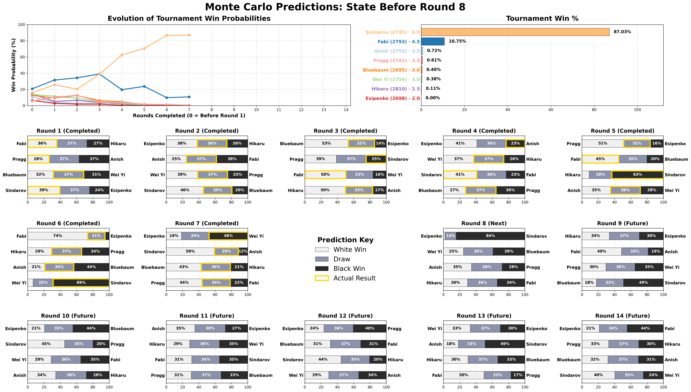
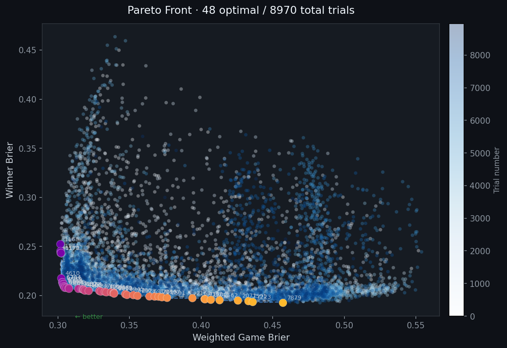

# Chess Monte Carlo Simulation

A multi-threaded Monte Carlo simulator for 8-player round-robin chess tournaments. Models dynamic per-player ratings that update as games are played, then runs millions of simulated completions to estimate win probabilities.

## 2026 Candidates — Live Predictions


<!-- Add new rounds here (most recent first): copy the <details> block and update the round number and image path -->

<details>
<summary>Round 8 — predictions</summary>



*Round 7 results: Wei Yi beat Esipenko, Sindarov–Anish drew, Bluebaum–Naka drew, Pragg–Fabi drew*

- ✓ **Wei Yi beat Esipenko** — model had Wei Yi at 47.5%, correct
- ✗ **Sindarov–Anish drew** — model had Sindarov at 59.2%; a 2.5-point lead removes urgency to press
- ✗ **Bluebaum–Naka drew** — model had Bluebaum at 43.0%
- ✗ **Pragg–Fabi drew** — model had Pragg at 44.0%; Fabi has now drawn 4 straight rounds since his R3 win
- Sindarov barely moves: **87.0%** (from 86.8%) — drawing costs almost nothing when the lead is this large

*Round 8 predictions:*
- Esipenko–Sindarov: 1.9% / 13.9% / **84.1%** — Sindarov near-certain; Esipenko at 2/7 is an extreme underdog
- Wei Yi–Bluebaum: 24.7% / 36.2% / **39.1%** — Bluebaum slight edge
- Anish–Pragg: **34.6%** / 37.5% / 28.0% — Anish slight edge
- Naka–Fabi: 29.7% / 36.5% / **33.7%** — Fabi slight edge

</details>

<details>
<summary>Round 7</summary>


*Round 6 results: Fabi–Esipenko drew, Naka–Pragg drew, Anish–Bluebaum drew, Sindarov beat Wei Yi*

- ✓ **Sindarov beat Wei Yi** — model had Sindarov as heavy favourite (68.8%), correct
- ✗ **Fabi–Esipenko drew** — model's biggest miss of the tournament: Fabi was a **73.6% favourite** yet drew; his inability to convert against lower-rated players is the central story
- ✗ **Naka–Pragg drew** — near coin-flip (Pragg 33.9%), draw not unexpected
- ✗ **Anish–Bluebaum drew** — model had Bluebaum at 43.6%
- Win probs: Sindarov **86.8%**, Fabi 9.8% — Fabi drawing while Sindarov winning collapses the race

*Round 7 predictions:*
- Esipenko–Wei Yi: 18.7% / 33.8% / **47.5%** — Wei Yi favoured
- Sindarov–Anish: **59.2%** / 29.2% / 11.6% — Sindarov strong favourite
- Bluebaum–Naka: **43.0%** / 35.7% / 21.3% — Bluebaum favoured
- Pragg–Fabi: **44.0%** / 34.4% / 21.6% — Pragg favoured

</details>

<details>
<summary>Round 6</summary>


*Round 5 results: Pragg–Esipenko drew, Fabi beat Bluebaum, Sindarov beat Naka, Anish–Wei Yi drew*

- ✓ **Fabi beat Bluebaum** — model had Fabi at 45.1%, correct
- ✓ **Sindarov beat Naka** — model had Sindarov as heavy favourite (63.3%), correct
- ✓ **Anish–Wei Yi drew** — near-even (Anish 35.1%), draw fine
- ✗ **Pragg–Esipenko drew** — model had Pragg at 51.3%
- Win probs: Sindarov **70.5%**, Fabi 23.7% — Sindarov's 4.5/5 gives him commanding odds

*Round 6 predictions:*
- Fabi–Esipenko: **73.6%** / 21.3% / 5.0% — Fabi overwhelming favourite; model expects him to close the gap
- Naka–Pragg: 29.4% / 36.7% / **33.9%** — Pragg slight edge
- Anish–Bluebaum: 21.1% / 35.4% / **43.6%** — Bluebaum favoured
- Wei Yi–Sindarov: 6.7% / 24.6% / **68.8%** — Sindarov heavy favourite

</details>

<details>
<summary>Round 5</summary>


*Round 4 results: Anish beat Esipenko, Wei Yi–Naka drew, Sindarov beat Fabi, Bluebaum–Pragg drew*

- ✓ **Sindarov beat Fabi** — model had Sindarov at 40.9%; **the tournament's turning point** — Sindarov opens a 1-point lead
- ✗ **Anish beat Esipenko** — model had Esipenko at 41.1%; Anish punching above expectations
- ✓ **Wei Yi–Naka drew** — near coin-flip (Wei Yi 37.4%), draw expected
- ✓ **Bluebaum–Pragg drew** — model had Pragg at 35.5%; near coin-flip
- Win probs: Sindarov **62.6%**, Fabi 19.7% — gap widens dramatically with Sindarov at 3.5/4

*Round 5 predictions:*
- Pragg–Esipenko: **51.3%** / 32.4% / 16.3% — Pragg favoured
- Fabi–Bluebaum: **45.1%** / 34.7% / 20.2% — Fabi strong favourite
- Naka–Sindarov: 8.9% / 27.8% / **63.3%** — Sindarov heavy favourite after 3.5/4
- Anish–Wei Yi: **35.1%** / 36.5% / 28.4% — Anish slight edge

</details>

<details>
<summary>Round 4</summary>


*Round 3 results: Bluebaum–Esipenko drew, Sindarov beat Pragg, Fabi beat Wei Yi, Naka–Anish drew*

- ✓ **Fabi beat Wei Yi** — model had Fabi at 50.5%, correct
- ✗ **Sindarov beat Pragg** — model had Pragg at 38.8% as White; Sindarov wins anyway
- ✗ **Bluebaum–Esipenko drew** — model had Bluebaum at 53.2%; biggest miss of the round
- ✗ **Naka–Anish drew** — model had Naka at 49.9%; another expected win becomes a draw
- Win probs: Fabi **39.0%**, Sindarov **38.7%** — nearly level, race wide open

*Round 4 predictions:*
- Esipenko–Anish: **41.1%** / 35.9% / 23.0% — Esipenko favoured
- Wei Yi–Naka: **37.4%** / 36.6% / 26.0% — Wei Yi slight edge
- Sindarov–Fabi: **40.9%** / 36.3% / 22.9% — Sindarov slight favourite
- Bluebaum–Pragg: 27.3% / 37.2% / **35.5%** — Pragg slight edge

</details>

<details>
<summary>Round 3</summary>


*Round 2 results: ALL FOUR games drew — Esipenko–Naka, Anish–Fabi, Wei Yi–Pragg, Sindarov–Bluebaum*

- ✗ **All 4 Round 2 games drew** — model had the expected leader winning in each (Esipenko 38.1%, Fabi 38.5% as Black, Wei Yi 38.6%, Sindarov 45.7%)
- Early-round draws are consistently underestimated; with no score pressure yet, all-draw rounds are plausible
- Win probs barely shift: Fabi **34.3%**, Sindarov **20.3%**, Pragg **12.7%** — stable after all draws

*Round 3 predictions:*
- Bluebaum–Esipenko: **53.2%** / 32.4% / 14.4% — Bluebaum strongly favoured; R1 win at very low prior creates an outsized strength estimate
- Pragg–Sindarov: **38.8%** / 36.5% / 24.7% — Pragg slight edge as White despite Sindarov's R1 win
- Fabi–Wei Yi: **50.5%** / 33.3% / 16.1% — Fabi strongly favoured
- Naka–Anish: **49.9%** / 33.3% / 16.8% — Naka strongly favoured

</details>

<details>
<summary>Round 2</summary>


*Round 1 results: Fabi beat Naka, Sindarov beat Esipenko, Pragg beat Anish, Bluebaum–Wei Yi drew*

- ✓ **Fabi beat Naka** — model's top pick (35.7%), correct
- ✓ **Sindarov beat Esipenko** — strongly predicted (39.4%), correct
- ✓ **Bluebaum–Wei Yi drew** — model near-even (31.5%/31.3%), draw fine
- ✗ **Pragg beat Anish** — model had Anish at 36.9%; Pragg punching above his pre-tournament rating
- All three R1 winners jump sharply: Fabi 20.8% → **31.5%**, Sindarov 15.7% → **25.7%**, Pragg 5.6% → **10.3%** — weak priors amplify single-game results immediately

*Round 2 predictions:*
- Esipenko–Naka: **38.1%** / 36.3% / 25.5% — Esipenko now favoured (flipped from pre-R1); low priors absorb Naka's R1 loss aggressively
- Anish–Fabi: 24.7% / 36.8% / **38.5%** — Fabi favoured
- Wei Yi–Pragg: **38.6%** / 36.6% / 24.8% — Wei Yi favoured
- Sindarov–Bluebaum: **45.7%** / 34.8% / 19.5% — Sindarov boosted further by R1 win

</details>

<details>
<summary>Round 1</summary>


*Pre-tournament predictions*

- **Fabi** is the favourite at **20.8%** — consistent profile across all three time controls gives a stable overall estimate
- **Sindarov at 15.7%** with only 2745 Elo — strongly rising classical trend [2721→2745, +24 pts] and improving rapid history; the model rewards recent momentum
- **Naka at 14.3%** despite the highest classical Elo (2810) — flat classical trend and weaker rapid/blitz velocity
- **Bluebaum at 12.6%** for a 2695-rated player — positive classical trend with no drag from weak secondary time controls
- **Pragg at only 5.6%** despite his FIDE ranking — classical rating falling [2768→2741, −27 pts]; the model tracks the trend, not the name

*Round 1 predictions:*
- Fabi–Naka: **35.7%** / 37.1% / 27.3% — Fabi slight favourite
- Pragg–Anish: 26.3% / 36.8% / **36.9%** — Anish favoured
- Bluebaum–Wei Yi: **31.5%** / 37.2% / 31.3% — near coin-flip
- Sindarov–Esipenko: **39.4%** / 36.5% / 24.1% — Sindarov clear favourite

</details>

## Repository Layout

```
src/                     C++ source and bundled json.hpp header
bin/                     Compiled binary (chess_montecarlo)
configs/                 Hyperparameter files and tuning snapshots
data/                    Tournament JSON files and raw PGN downloads
  raw/                   Raw PGN broadcasts downloaded from Lichess
results/                 Per-tournament visualizations and simulation outputs
  candidates2026/
    rounds/              round{N}.txt simulation outputs
    r{N}.png             Per-round bar charts
    animation.gif        Animated GIF of all rounds
scripts/                 Python helper scripts
  build_tournament.py    Build tournament.json from a Lichess broadcast
  visualize_timeline.py  Generate dashboard PNGs from round outputs
  make_gif.py            Combine round PNGs into an animated GIF
  pareto_front.py        Visualize Optuna Pareto front and print best trials
db/                      Optuna SQLite databases for hyperparameter tuning
tune.py                  Optuna hyperparameter search driver
evaluate.py              Score a fixed hyperparameter set against tournament data
utils.py                 Shared scoring utilities (used by tune.py and evaluate.py)
install.sh               Dependency installation snippet
```

## Features

- **Dynamic Bayesian ratings** — a 2N anchored MAP estimator maintains separate White and Black latent strengths per player, updated every round
- **Parametric draw model** — draw probability proportional to ν·√(λW·λB), where ν is a time-control-specific tuning parameter (`classical_nu`, `rapid_nu`, `blitz_nu`)
- **Style multiplier** — each player has Bayesian-smoothed White/Black aggression scores (fraction of decisive games); ν is scaled by `baselineAgg / matchAgg`, shrinking the draw band when both players play sharply and inflating it when they play solidly
- **Standings multiplier** — ν is scaled by each player's *motivation*, then averaged. Motivation is computed from `R = deficit / roundsLeft`: leaders (R ≤ 0) play at baseline; contenders (0 < R < 0.75) get a desperation boost peaking at R = 0.375; near-eliminated players (R ≥ 0.75) widen their draw band as they relax pressure
- **Color bleed** — aggression and rating form cross-pollinate between colors; λW/λB are also geometrically blended after each MAP update and rescaled to prevent drift
- **Velocity projection** — per-player rating trends across all three time controls are estimated via time-decayed weighted least-squares regression; rapid/blitz deltas are blended in via `rapid_form_weight` and `blitz_form_weight`
- **Time control support** — uses Classical, Rapid, or Blitz ratings for the appropriate stage
- **FIDE 2026 playoff rules** — tiebreaks follow the official Rapid → Blitz → Sudden-death knockout sequence (Regulation 4.4.2)
- **Parallel simulation** — work is distributed across all hardware threads via `std::thread`

## Build

```bash
g++ -O3 -march=native -std=c++17 -pthread src/chess_montecarlo.cpp -o bin/chess_montecarlo
```

Requires a C++17-capable compiler. The only dependency is [`json.hpp`](https://github.com/nlohmann/json) (included in `src/`).

## Usage

```bash
./bin/chess_montecarlo [hyperparameters.json] [tournament.json] [simulate_from_round]
```

`simulate_from_round` must be passed as a CLI argument. Output is printed to stdout.

```bash
./bin/chess_montecarlo configs/best_hparams_22_24.json data/candidates2026.json 8 > results/candidates2026/rounds/round8.txt
```

## JSON format

**`configs/hyperparameters.json`** — all fields are tunable; see `configs/best_hparams_22_24.json` for a working example. Key groups: `runs`/`map_iters`/`map_tolerance` (simulation), `prior_weight_known`/`prior_weight_sim` (MAP priors), `initial_white_adv`/`velocity_time_decay`/`lookahead_factor` (rating init), `rapid_form_weight`/`blitz_form_weight`/`color_bleed` (cross-time-control blending), `classical_nu`/`rapid_nu`/`blitz_nu` (draw model), `agg_prior_weight`/`default_aggression_w`/`default_aggression_b`/`standings_aggression` (aggression).

**`data/candidates2026.json`** — `players` (array of 8; required: `fide_id`, `name`, `rating`; optional: `rapid_rating`, `blitz_rating`, `aggression_w/b`, `history`/`games_played`, `rapid_history`/`rapid_games_played`, `blitz_history`/`blitz_games_played`) and `schedule` (array of `{white, black[, result]}`). Games without `result` are future games. Games are grouped into rounds of `N/2`; games from `simulate_from_round` onward are simulated.

## Building tournament data

`scripts/build_tournament.py` downloads games from a Lichess broadcast, fetches FIDE rating history, and writes a ready-to-use tournament JSON.

```bash
pip install requests python-chess

python scripts/build_tournament.py wEuVhT9c -o data/my_tournament.json
python scripts/build_tournament.py wEuVhT9c --as-of 2024-04    # slice FIDE history to a month
python scripts/build_tournament.py wEuVhT9c --no-fide           # skip FIDE fetch
python scripts/build_tournament.py wEuVhT9c --periods 8         # history depth (default: 6)
```

## Hyperparameter tuning

`tune.py` uses [Optuna](https://optuna.org) to search for the best model parameters via multi-objective optimization.

```bash
pip install optuna

# Run 200 trials on a single tournament (always resumes an existing study automatically)
python tune.py configs/hyperparameters.json data/candidates2024.json

# Run against multiple tournaments simultaneously (scores are averaged)
python tune.py configs/hyperparameters.json data/candidates2022.json data/candidates2024.json

# Custom binary or database path
python tune.py configs/hyperparameters.json data/candidates2024.json \
    --binary ./bin/chess_montecarlo \
    --db db/tuning_2024.db \
    --trials 500
```

For each round K with known results, the binary runs with `simulate_from_round = K`; rounds K onward are held-out predictions. Two objectives are minimized simultaneously:

1. **Weighted Game Brier Score** — multi-class Brier score over all predicted games, decay-weighted by `FUTURE_DECAY_WEIGHT^distance`. Decisive outcomes are up-weighted by `DECISIVE_GAME_WEIGHT` to combat the lazy-draw problem.
2. **Winner Brier Score** — Brier score over tournament win probability predictions.

Both are accumulated weighted by round number (`score × r / Σr`): a round-13 error counts 13× more than round 1. When multiple tournament files are supplied, scores are averaged across tournaments. `EVAL_RUNS` in `utils.py` controls Monte Carlo iterations per trial (default 10 000).

```bash
python scripts/pareto_front.py db/tuning_22_24.db chess_montecarlo
python scripts/pareto_front.py db/tuning_22_24.db chess_montecarlo --save results/pareto.png
```

**2022 + 2024 Candidates — 8 970 trials, 48 Pareto-optimal:**



`pareto_front.py` ranks trials by combined score (Game Brier + Winner Brier); the #1 trial is saved as `configs/best_hparams_22_24.json` and used for the 2026 Candidates predictions.

### `best_hparams_22_24.json` — parameter interpretation

| Parameter | Value | Interpretation |
|---|---|---|
| `prior_weight_known/sim` | 0.30 / 2.01 | Weak priors — the model reacts sharply to each result; one decisive win can significantly shift win probabilities |
| `initial_white_adv` | 2.5 Elo | Very small White color advantage |
| `lookahead_factor` | 4.70 | Rating trend is strongly extrapolated forward; players with rising ratings are credited substantially |
| `velocity_time_decay` | 0.69 | Moderate decay; recent rating history is weighted more than older entries but not exclusively |
| `rapid_form_weight / blitz_form_weight` | −0.50 / −0.50 | Rapid and blitz trends slightly reduce the classical form anchor |
| `classical_nu` | 1.19 | Moderate draw rate for classical games |
| `rapid_nu` | 0.88 | Lower draw rate for rapid tiebreaks |
| `blitz_nu` | 0.72 | Lowest draw rate for blitz tiebreaks |
| `agg_prior_weight` | 75.3 | Strong aggression prior — individual aggression scores deviate little from the default |
| `standings_aggression` | 0.033 | Minimal desperation effect; tournament standings have little influence on game aggression |

## Evaluating a fixed parameter set

`evaluate.py` scores a specific hyperparameter file against one or more tournament files using the same Weighted Game Brier Score and Winner Brier Score as the tuner. Useful for cross-tournament validation or checking parameters against an ongoing tournament where the winner is not yet known.

```bash
# Score 2022+2024-tuned params against 2022 data
python evaluate.py configs/best_hparams_22_24.json data/candidates2022.json

# Cross-validate: check against a different tournament
python evaluate.py configs/best_hparams_22_24.json data/candidates2022.json data/candidates2024.json

# Ongoing tournament — winner Brier score is skipped automatically
python evaluate.py configs/best_hparams_22_24.json data/candidates2026.json

# Higher fidelity (default is 10 000)
python evaluate.py configs/best_hparams_22_24.json data/candidates2024.json --runs 100000
```

Per-round scores are printed as the evaluation runs. For ongoing tournaments (any schedule entry without a `result`), winner MSE is skipped and reported as `N/A`. When multiple tournament files are supplied, the winner Brier average excludes any ongoing ones.

## Visualization

Requires Python with `matplotlib`, `pandas`, and `numpy`.

```bash
# Generate per-round dashboard PNGs
python scripts/visualize_timeline.py results/candidates2026/rounds/
python scripts/visualize_timeline.py results/candidates2026/rounds/ -o my_output.png
python scripts/visualize_timeline.py results/candidates2026/rounds/ -k 5   # only up to round 5

# Combine all round PNGs into an animated GIF
python scripts/make_gif.py results/candidates2026/
python scripts/make_gif.py results/candidates2026/ -d 3000 --last-duration 10000
```

`visualize_timeline.py` reads all `round{N}.txt` files in the given directory and produces a dashboard PNG showing win probability timeline, current win % bar chart, and per-round match prediction breakdowns (with actual results highlighted in gold).

## How the model works

Each player has latent strengths λW (White) and λB (Black), initialized from a projected FIDE rating ± `initial_white_adv/2` Elo. If rating history is provided, a time-decayed least-squares velocity is estimated and projected forward by `lookahead_factor`; rapid/blitz deltas blend in via `rapid_form_weight` / `blitz_form_weight`.

After each round, λW/λB are updated via:
1. **MAP fixed-point iteration** — anchored Bradley-Terry MAP given all games played; prior strength is `prior_weight_known` for historical rounds and `prior_weight_sim` for simulated ones.
2. **Color bleed** — White/Black relative form are geometrically blended via `color_bleed`, then population-rescaled to prevent drift.

Game probabilities: `p_win = λW[w]/Z`, `p_draw = ν·√(λW[w]·λB[b])/Z`, `p_loss = λB[b]/Z`. The draw parameter ν is scaled per game by:
- **Style multiplier** — `baselineAgg / matchAgg` (Bayesian-smoothed decisive-game fractions); aggressive pairings shrink the draw band.
- **Standings multiplier** — average of both players' motivation from `R = deficit / roundsLeft`; contenders at R ≈ 0.375 peak in desperation, near-eliminated players widen the draw band.
