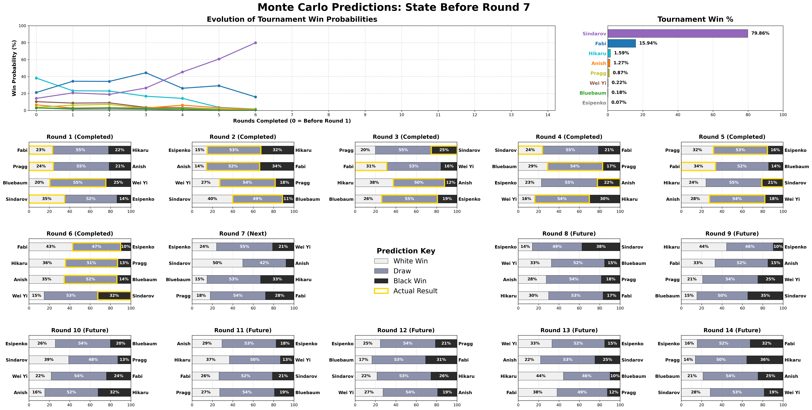

# Chess Monte Carlo Simulation

A multi-threaded Monte Carlo simulator for 8-player round-robin chess tournaments. Uses an Ordered Logit model in log-odds (theta) space with hierarchical covariance shrinkage, then runs millions of simulated completions to estimate win probabilities.

The included `tournament.json` models the **2026 FIDE Candidates Tournament** (Caruana, Nakamura, Giri, Yi Wei, Sindarov, Praggnanandhaa, Esipenko, Bluebaum).

## Animated GIF


Run `make_gif.py` to combine all round PNGs in `results/` into `results/animation.gif`.

```
python3 make_gif.py
```

## Visualizations

<!-- Add new rounds here (most recent first): copy the <details> block and update the round number and image path -->

<details>
<summary>Round 7</summary>



</details>

<details>
<summary>Round 6</summary>


</details>

<details>
<summary>Round 5</summary>


</details>

<details>
<summary>Round 4</summary>


</details>

<details>
<summary>Round 3</summary>


</details>

<details>
<summary>Round 2</summary>


</details>

<details>
<summary>Round 1</summary>


</details>

## Features

- **Ordered Logit outcome model** — win/draw/loss probabilities derived from a logistic CDF with calibrated draw thresholds; naturally handles the three-way outcome without separate draw-rate tuning per player pair
- **Theta (log-odds) space** — all ratings are stored and compared in log-odds space (`Elo × ln(10)/400`), making differences directly interpretable as log-odds ratios
- **Rating velocity projection** — time-decayed weighted least squares over historical rating lists estimates each player's current trajectory; the slope (theta/period) is projected forward by `lookahead_factor`
- **Hierarchical covariance shrinkage** — a Laplace/Inverse-Wishart prior over the (Classical, Rapid, Blitz) theta vector shrinks Rapid/Blitz ratings toward the Classical estimate, regularizing players with sparse rapid/blitz history
- **Separate time-control ratings** — Classical, Rapid, and Blitz thetas are tracked independently; the correct rating is used for each game type
- **Streak momentum** — players on a consecutive win streak receive a positive theta boost; losing streaks apply a negative boost; draws reset the streak
- **FIDE 2026 playoff rules** — tiebreaks follow a Blitz sudden-death knockout sequence
- **Parallel simulation** — work is distributed across all hardware threads via `std::thread`

## Build

```bash
g++ -O3 -march=native -std=c++17 -pthread chess_montecarlo.cpp -o chess_montecarlo
```

Requires a C++17-capable compiler. The only dependency is [`json.hpp`](https://github.com/nlohmann/json) (included).

## Usage

```bash
./chess_montecarlo [tournament.json] [simulate_from_round]
```

Defaults to `tournament.json` in the current directory. The optional second argument overrides which round to simulate from. Output is printed to stdout.

Redirect to a file to feed into the visualizer:

```bash
./chess_montecarlo tournament.json > results/rounds/round5.txt
```

## Tournament JSON format

```jsonc
{
  "runs": 10000000,              // number of Monte Carlo iterations

  // Velocity projection
  "lookahead_factor": 4.0,       // multiplier on the estimated rating slope
  "velocity_time_decay": 0.95,   // exponential decay weight for older history entries

  // Ordered Logit parameters
  "initial_white_adv": 35.0,     // White advantage in Elo (converted to theta internally)
  "draw_rate_classical": 0.55,   // empirical draw rate — calibrates the classical draw threshold
  "draw_rate_rapid": 0.35,       // empirical draw rate — calibrates the rapid draw threshold
  "draw_rate_blitz": 0.25,       // empirical draw rate — calibrates the blitz draw threshold

  // Hierarchical shrinkage prior
  "epistemic_variance": 0.5,     // tau² — prior variance on player theta vectors
  "iw_degrees_of_freedom": 4,    // nu — Inverse-Wishart degrees of freedom

  "players": [
    {
      "fide_id": 2020009,
      "name": "Caruana, Fabiano",
      "rating": 2793,                          // FIDE classical rating
      "rapid_rating": 2727,                    // optional, falls back to rating
      "blitz_rating": 2749,                    // optional, falls back to rating

      // Historical rating lists (oldest → newest) for velocity estimation
      "history": [2795, 2795, 2795, 2793],     // classical
      "games_played": [15, 0, 0, 16],          // games in each period (weights the WLS)
      "rapid_history": [2751, 2727],
      "rapid_games_played": [22, 2],
      "blitz_history": [2751, 2769, 2749],
      "blitz_games_played": [8, 23, 15]
    }
    // ... 7 more players (exactly 8 required)
  ],

  "schedule": [
    { "white": 2020009, "black": 2016192, "result": "1-0"     }, // known game
    { "white": 2020009, "black": 2016192, "result": "1/2-1/2" }, // known game
    { "white": 2020009, "black": 2016192 }                       // future game (no result)
  ]
}
```

Games are grouped into rounds of 4 (`N/2`). Games before `simulate_from_round` must have a `result`; games from that round onward are simulated.

## Visualization

Requires Python with `matplotlib`, `pandas`, and `numpy`.

```bash
python visualize_timeline.py results/rounds/
```

Reads all `round{N}.txt` files in the given directory and produces a dashboard PNG showing:

- Win probability timeline across rounds
- Current win % bar chart
- Per-round match prediction breakdowns (with actual results highlighted in gold)

```bash
python visualize_timeline.py results/rounds/ -o my_output.png  # custom output path
python visualize_timeline.py results/rounds/ -k 5              # only show up to round 5
```

Output is saved as `round{N}.png` in the input directory by default.

## How the model works

### Rating representation

All ratings are stored in **theta space** (log-odds units): `θ = Elo × ln(10)/400`. Differences between thetas are directly interpretable as log-odds of one player winning. The population is mean-centered for identifiability.

### Velocity projection

For each player and time control (Classical, Rapid, Blitz), a **time-decayed weighted least squares** regression is run over the historical rating list. The slope (theta units per period) is the estimated rating velocity. This slope is projected forward by `lookahead_factor` and added to the current rating, modeling expected form at tournament time.

### Hierarchical shrinkage

A **Laplace/Inverse-Wishart** prior over the 3-dimensional (Classical, Rapid, Blitz) theta vector is used to regularize ratings. Concretely, the Classical theta of each player is updated by a conditional shift derived from the Rapid and Blitz observations, weighted by the estimated cross-covariance. This pulls players with consistent rapid/blitz performance toward their implied classical strength, and regularizes outliers with sparse history.

### Game outcome model

Win/draw/loss probabilities follow an **Ordered Logit** model:

```
delta  = θW - θB + γ          (γ = white advantage in theta space)
p_loss = σ((-c - delta))
p_win  = 1 - σ((c - delta))
p_draw = 1 - p_loss - p_win
```

where `σ` is the logistic sigmoid and `c` is the draw threshold calibrated from the empirical draw rate for the time control:

```
c = log((1 + draw_rate) / (1 - draw_rate))
```

For classical games, a **streak momentum** term is added to each player's theta before computing probabilities: `+0.2 × streak` per consecutive win (negative for losses), modeling psychological momentum.

### Tiebreaks

When multiple players finish with equal points, a Blitz sudden-death playoff is simulated using each player's Blitz theta.
