# Chess Monte Carlo Simulation

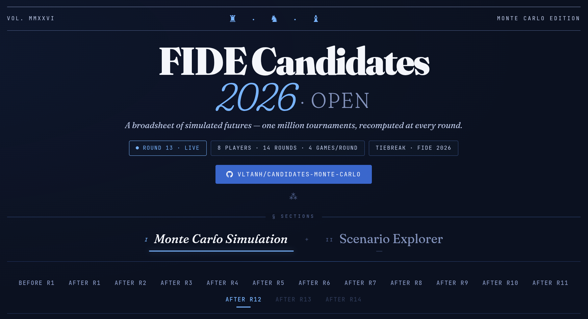

Predicts chess tournament outcomes by simulating millions of possible futures. Given a tournament schedule and player ratings, it estimates each player's chance of winning the tournament, expected final score, and per-game win/draw/loss probabilities, updated after every round.

## 2026 Candidates: Live Predictions

### Dashboard

**Project page: [https://vltanh.github.io/projects/chess-monte-carlo-simulation/](https://vltanh.github.io/projects/chess-monte-carlo-simulation/)**

Direct links to the interactive dashboards:

- **Open:** [https://vltanh.github.io/assets/chess/candidates2026.html](https://vltanh.github.io/assets/chess/candidates2026.html)
- **Women:** [https://vltanh.github.io/assets/chess/candidateswomen2026.html](https://vltanh.github.io/assets/chess/candidateswomen2026.html)

A self-contained interactive HTML page (no server, no dependencies) generated by `tools/viz/generate_html.py`. Features:

- **Win probability timeline** with per-player toggle chips and round selector
- **Standings table** with sortable columns, inline win-% bars, and player ratings
- **Title race chart** showing contenders vs eliminated players (✗), determined by a 4-phase algorithm: max-reachable-points → per-game guaranteed floor → 1M uniform sampling → exhaustive DFS
- **Scenario explorer**: interactive SVG decision tree - inject hypothetical results, follow truth, or find winning paths for any player (weighted/uniform sampling → precomputed path → DFS fallback); breadcrumb trail with inline edit popovers
- **Match predictions**: per-game win/draw/loss bars for every round, with actual results highlighted in gold; collapsible past/future round panels
- **Rank distribution heatmap** with sortable columns and color-intensity scaling
- **Expected final score timeline** tracking projected points across rounds
- **Hyperparameter appendix**: Pareto front scatter chart, best-trial table, grouped parameter display
- **Player info table** with FIDE IDs and Classical/Rapid/Blitz ratings
- Dark theme, mobile-responsive, smooth animations, custom scrollbars

### Round-by-round commentary (Open section)

The commentary below covers the **Open** section only. See the [Women's dashboard](https://vltanh.github.io/assets/chess/candidateswomen2026.html) for the Women's section.

#### Round 13

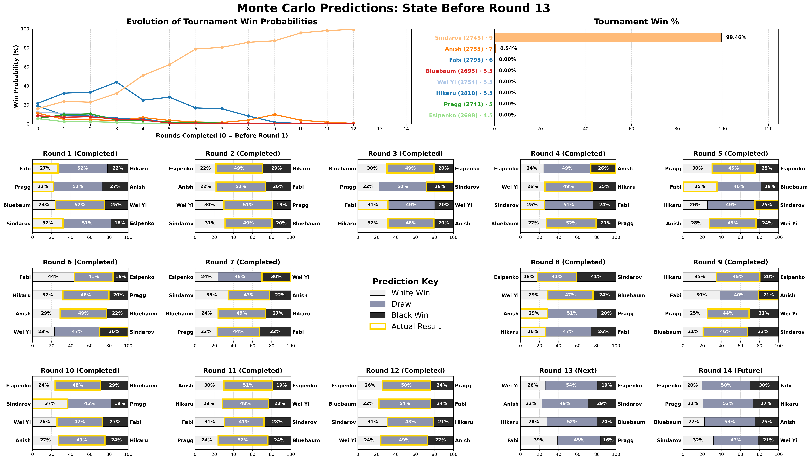

*Round 12 results: Esipenko–Pragg drew, Bluebaum–Fabi drew, Sindarov–Hikaru drew, Wei Yi–Anish drew*

- ✓ **Esipenko–Pragg drew**: draw predicted at 50.2%; correct prediction
- ✓ **Bluebaum–Fabi drew**: draw predicted at 54.1%; correct prediction
- ✓ **Sindarov–Hikaru drew**: draw predicted at 47.8%; correct prediction; Sindarov continues to coast toward the title
- ✓ **Wei Yi–Anish drew**: draw predicted at 49.1%; correct prediction; Anish needed a win but could not break through
- **Perfect 4/4 round** - the second consecutive all-draw round called correctly
- Win probs: Sindarov rose to **99.5%** (from 98.2%); Anish slipped to **0.5%** (from 1.8%); Fabi eliminated at **0.0%** (from 0.01%)

*Standings after R12 (2 rounds remaining):*

| Player | Pts | Max | Status |
|---|---|---|---|
| Sindarov | 9.0 | 11.0 | Virtually clinched; min score of 9.0 already unreachable by all but Anish |
| Anish | 7.0 | 9.0 | Only remaining challenger (0.5%); must beat Sindarov in R13 |
| Fabi | 6.0 | 8.0 | **Eliminated** - max 8.0 cannot catch Sindarov's floor of 9.0 |
| Bluebaum | 5.5 | 7.5 | **Eliminated** |
| Wei Yi | 5.5 | 7.5 | **Eliminated** |
| Hikaru | 5.5 | 7.5 | **Eliminated** |
| Pragg | 5.0 | 7.0 | **Eliminated** |
| Esipenko | 4.5 | 6.5 | **Eliminated** |

*What would it take?*
- **Sindarov (99.5%)**: already at 9.0 with 2 to play. Even losing both remaining games keeps him at 9.0, which only Anish can match (at best). A single draw in R13 (vs Anish) seals the title outright, as Anish could reach at most 8.5. The only path where Sindarov does not win first place: Anish beats him in R13, Anish beats Bluebaum in R14, AND Sindarov loses to Wei Yi in R14, producing a 9.0–9.0 tie decided by FIDE tiebreak.
- **Anish (0.5%)**: 2 points behind with 2 to play. Must win both remaining games (vs Sindarov in R13, vs Bluebaum in R14) AND Sindarov must lose to Wei Yi in R14. That produces a 9.0–9.0 tie and a FIDE rapid/blitz tiebreak. A draw in R13 mathematically eliminates Anish.

*Round 13 predictions:*
- Wei Yi–Esipenko: 26.1% / **54.4%** / 19.5%, draw most likely; Wei Yi with higher winning chances
- Anish–Sindarov: 22.3% / **48.6%** / 29.0%, draw most likely; Sindarov with higher winning chances; Anish must win to stay alive
- Hikaru–Bluebaum: 28.0% / **52.4%** / 19.6%, draw most likely; Hikaru with higher winning chances
- Fabi–Pragg: 38.9% / **44.9%** / 16.2%, draw most likely; Fabi with higher winning chances

#### Previous rounds

<details>
<summary>Round 12</summary>

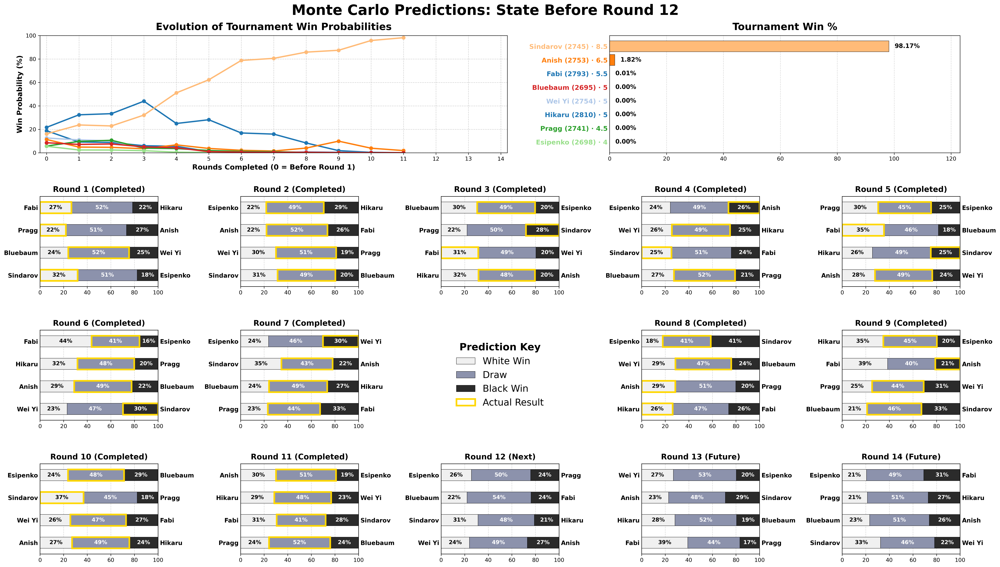

*Round 11 results: Anish–Esipenko drew, Hikaru–Wei Yi drew, Fabi–Sindarov drew, Pragg–Bluebaum drew*

- ✓ **Anish–Esipenko drew**: draw predicted at 50.8%; correct prediction
- ✓ **Hikaru–Wei Yi drew**: draw predicted at 48.2%; correct prediction
- ✓ **Fabi–Sindarov drew**: draw predicted at 41.5%; correct prediction
- ✓ **Pragg–Bluebaum drew**: draw predicted at 51.8%; correct prediction
- **Perfect 4/4 round** - all four draws called correctly
- Win probs: Sindarov rose to **98.2%** (from 95.8%); Anish slipped to **1.8%** (from 3.9%); Fabi at **0.01%** (from 0.3%) - a rounding error away from elimination

*Round 12 predictions:*
- Esipenko–Pragg: 25.7% / **50.2%** / 24.1%, draw most likely; essentially even; a dead rubber for both eliminated players
- Bluebaum–Fabi: 22.1% / **54.1%** / 23.8%, draw most likely; Fabi must win to keep any hope alive
- Sindarov–Hikaru: 31.3% / **47.8%** / 20.9%, draw most likely; Sindarov with higher winning chances; a win clinches the tournament outright
- Wei Yi–Anish: 24.1% / **49.1%** / 26.9%, draw most likely; Anish with higher winning chances; must win to have any chance in R13

</details>

<details>
<summary>Round 11</summary>

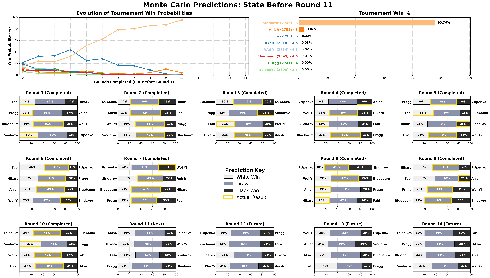

*Round 10 results: Esipenko–Bluebaum drew, Sindarov beat Pragg, Wei Yi–Fabi drew, Anish–Hikaru drew*

- ✓ **Esipenko–Bluebaum drew**: draw predicted at 47.5%; correct prediction
- ✓ **Wei Yi–Fabi drew**: draw predicted at 47.1%; correct prediction
- ✓ **Anish–Hikaru drew**: draw predicted at 48.6%; correct prediction
- ✗ **Sindarov beat Pragg**: draw predicted at 45.5%; Sindarov won; the model correctly placed Sindarov's winning chances (36.9%) well above Pragg's (17.6%)
- Win probs: Sindarov surged to **95.8%** (from 87.4%) after extending his lead; Anish slipped to **3.9%** (from 9.9%) after the draw; Fabi collapsed to **0.3%** (from 1.7%) - effectively out of contention

*Round 11 predictions:*
- Anish–Esipenko: 30.1% / **50.8%** / 19.1%, draw most likely; Anish with higher winning chances
- Hikaru–Wei Yi: 28.5% / **48.2%** / 23.3%, draw most likely; Hikaru with higher winning chances
- Fabi–Sindarov: 30.6% / **41.5%** / 28.0%, draw most likely; essentially even; Fabi needs a win to have any hope of catching Sindarov
- Pragg–Bluebaum: 24.1% / **51.8%** / 24.0%, draw most likely; essentially even

</details>

<details>
<summary>Round 10</summary>

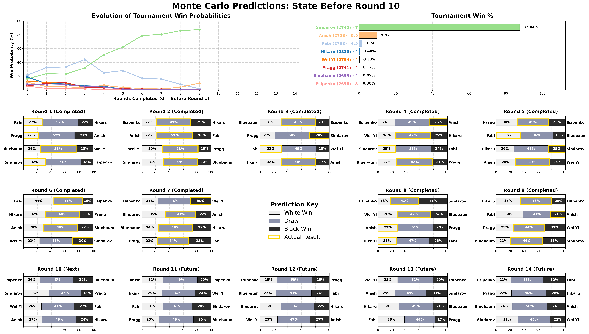

*Round 9 results: Hikaru–Esipenko drew, Anish beat Fabi, Pragg–Wei Yi drew, Bluebaum–Sindarov drew*

- ✓ **Hikaru–Esipenko drew**: draw predicted at 45.5%; correct prediction
- ✓ **Pragg–Wei Yi drew**: draw predicted at 43.9%; correct prediction; Pragg had a winning position but blundered to a draw despite being the lower-probability side (25.3% vs Wei Yi's 30.9%)
- ✓ **Bluebaum–Sindarov drew**: draw predicted at 46.3%; correct prediction; Sindarov had a winning position but blundered to a draw
- ✗ **Anish beat Fabi**: draw predicted at 40.5% with Fabi win at 38.5%; Anish won despite having lower winning chances (21.0% vs 38.5%); wrong direction
- Win probs: Sindarov holds at **87.4%** (from 85.8%); Anish surged to **9.9%** (from 4.0%) after the upset win; Fabi collapsed to **1.7%** (from 8.3%)

*Round 10 predictions:*
- Esipenko–Bluebaum: 23.6% / **47.5%** / 28.9%, draw most likely; Bluebaum with higher winning chances
- Sindarov–Pragg: 36.9% / **45.5%** / 17.6%, draw most likely; Sindarov with higher winning chances
- Wei Yi–Fabi: 25.7% / **47.1%** / 27.1%, draw most likely; essentially even; Fabi needs a win to keep any hope alive
- Anish–Hikaru: 27.0% / **48.6%** / 24.3%, draw most likely; Anish with higher winning chances

</details>

<details>
<summary>Round 9</summary>

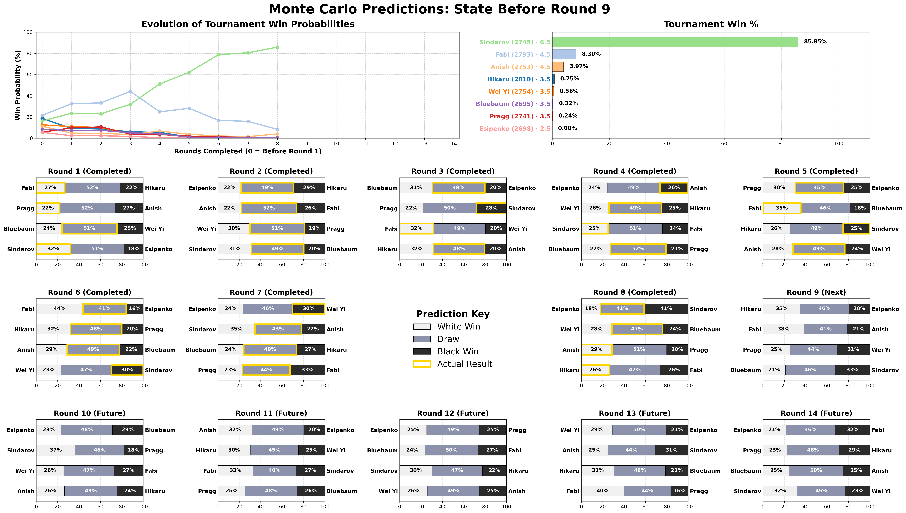

*Round 8 results: Esipenko–Sindarov drew, Wei Yi–Bluebaum drew, Anish beat Pragg, Hikaru beat Fabi*

- ✓ **Wei Yi–Bluebaum drew**: draw predicted at 47.4%; correct prediction
- ✗ **Esipenko–Sindarov drew**: Sindarov win predicted at 41.2% over draw at 40.8%; Sindarov drew; a leader with Black and a near-insurmountable lead has every incentive to play for safety, which the model's standing-based draw multiplier only partially captures
- ✗ **Anish beat Pragg**: draw predicted at 51.2%; Anish won; the model correctly placed Anish's winning chances (28.6%) above Pragg's (20.2%)
- ✗ **Hikaru beat Fabi**: draw predicted at 47.4%; Hikaru won; the model gave Hikaru an extremely marginal win edge (26.33% vs 26.27%); effectively no directional signal
- Win probs: Sindarov climbed to **85.8%** (from 80.6%); Fabi dropped sharply to **8.3%** (from 15.9%) after the loss; Anish rose to **4.0%** (from 1.5%) after the win

*Round 9 predictions:*
- Hikaru–Esipenko: 34.9% / **45.5%** / 19.6%, draw most likely; Hikaru with higher winning chances
- Fabi–Anish: 38.5% / **40.5%** / 21.0%, draw most likely; Fabi with higher winning chances; key duel for second place
- Pragg–Wei Yi: 25.3% / **43.9%** / 30.9%, draw most likely; Wei Yi with higher winning chances
- Bluebaum–Sindarov: 21.0% / **46.3%** / 32.7%, draw most likely; Sindarov with higher winning chances

</details>

<details>
<summary>Round 8</summary>

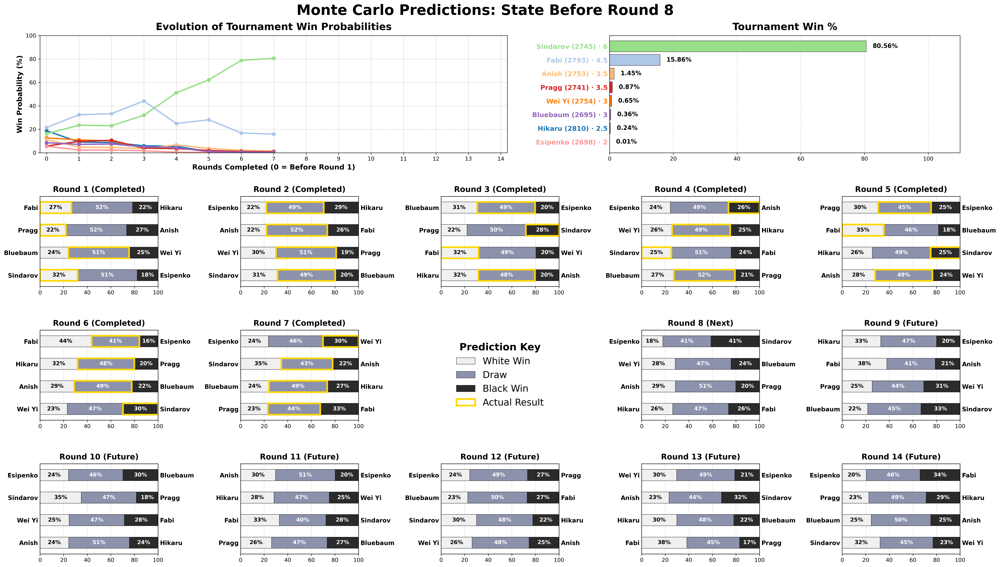

*Round 7 results: Wei Yi beat Esipenko, Sindarov–Anish drew, Bluebaum–Hikaru drew, Pragg–Fabi drew*

- ✓ **Sindarov–Anish drew**: draw predicted at 43.4%; correct prediction
- ✓ **Bluebaum–Hikaru drew**: draw predicted at 49.4%; correct prediction
- ✓ **Pragg–Fabi drew**: draw predicted at 44.4%; correct prediction
- ✗ **Wei Yi beat Esipenko**: draw predicted at 46.2%; Wei Yi won; the model correctly placed Wei Yi's winning chances (30.1%) above Esipenko's (23.7%)
- Sindarov barely moved: **80.6%** (from 78.8%); drawing cost almost nothing with the lead this large; Fabi slipped to **15.9%** (from 16.8%)

*Round 8 predictions:*
- Esipenko–Sindarov: 18.0% / 40.8% / **41.2%**, Sindarov win the top prediction; Esipenko at 2/7 was an extreme underdog
- Wei Yi–Bluebaum: 28.5% / **47.4%** / 24.1%, draw most likely; Wei Yi with higher winning chances
- Anish–Pragg: 28.6% / **51.2%** / 20.2%, draw most likely; Anish with higher winning chances
- Hikaru–Fabi: 26.3% / **47.4%** / 26.3%, draw most likely; perfectly balanced; Fabi needs a win to stay alive

</details>

<details>
<summary>Round 7</summary>

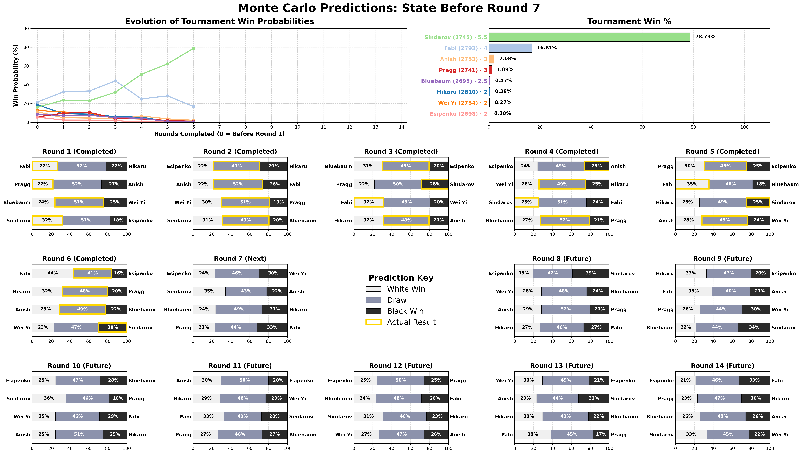

*Round 6 results: Fabi–Esipenko drew, Hikaru–Pragg drew, Anish–Bluebaum drew, Sindarov beat Wei Yi*

- ✓ **Hikaru–Pragg drew**: draw predicted at 48.1%; correct prediction
- ✓ **Anish–Bluebaum drew**: draw predicted at 48.7%; correct prediction
- ✗ **Fabi–Esipenko drew**: Fabi win predicted at 43.6% with draw at 40.5%; the game ended in a draw; Fabi's inability to convert against lower-rated players is the central story
- ✗ **Sindarov beat Wei Yi**: draw predicted at 47.3%; Sindarov won; the model correctly placed Sindarov's winning chances (29.7%) above Wei Yi's (23.1%)
- Win probs: Sindarov surged to **78.8%** (from 62.2%) while Fabi dropped to **16.8%** (from 28.1%); Fabi's draw combined with Sindarov's win collapsed the race

*Round 7 predictions:*
- Esipenko–Wei Yi: 23.7% / **46.2%** / 30.1%, draw most likely; Wei Yi with higher winning chances
- Sindarov–Anish: 34.5% / **43.4%** / 22.1%, draw most likely; Sindarov with higher winning chances
- Bluebaum–Hikaru: 24.0% / **49.4%** / 26.6%, draw most likely; Hikaru with slight win edge
- Pragg–Fabi: 23.1% / **44.4%** / 32.6%, draw most likely; Fabi with higher winning chances; needs points to stay in contention

</details>

<details>
<summary>Round 6</summary>

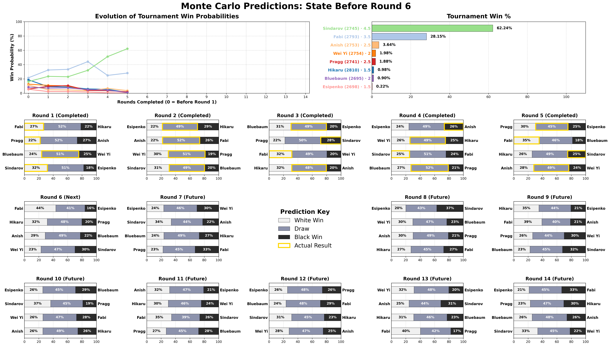

*Round 5 results: Pragg–Esipenko drew, Fabi beat Bluebaum, Sindarov beat Hikaru, Anish–Wei Yi drew*

- ✓ **Pragg–Esipenko drew**: draw predicted at 44.8%; correct prediction
- ✓ **Anish–Wei Yi drew**: draw predicted at 48.5%; correct prediction
- ✗ **Fabi beat Bluebaum**: draw predicted at 46.3%; Fabi won; the model correctly placed Fabi's winning chances (35.4%) above Bluebaum's (18.3%)
- ✗ **Sindarov beat Hikaru**: draw predicted at 49.4%; Sindarov won despite Hikaru having the marginal win edge (25.6% vs 25.0%); wrong direction by the narrowest margin
- Win probs: Sindarov extended his lead to **62.2%** (from 51.1%), Fabi recovered slightly to **28.1%** (from 24.9%); Sindarov's 4.5/5 gave him commanding odds

*Round 6 predictions:*
- Fabi–Esipenko: **43.6%** / 40.5% / 15.8%, Fabi win the top prediction; model expected him to capitalize on the rating gap and close on Sindarov
- Hikaru–Pragg: 31.8% / **48.1%** / 20.1%, draw most likely; Hikaru with higher winning chances
- Anish–Bluebaum: 28.9% / **48.7%** / 22.4%, draw most likely; Anish with higher winning chances
- Wei Yi–Sindarov: 23.1% / **47.3%** / 29.7%, draw most likely; Sindarov with higher winning chances

</details>

<details>
<summary>Round 5</summary>

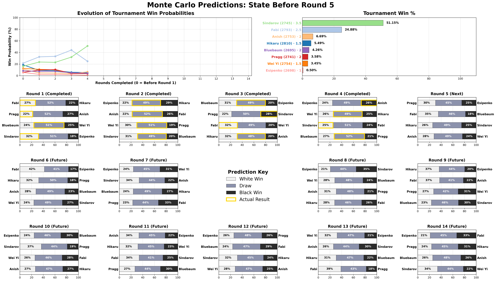

*Round 4 results: Anish beat Esipenko, Wei Yi–Hikaru drew, Sindarov beat Fabi, Bluebaum–Pragg drew*

- ✓ **Wei Yi–Hikaru drew**: draw predicted at 49.3%; correct prediction
- ✓ **Bluebaum–Pragg drew**: draw predicted at 51.9%; correct prediction
- ✗ **Sindarov beat Fabi**: draw predicted at 50.8%; Sindarov won; the model barely placed Sindarov's winning chances (25.2%) above Fabi's (24.0%); **the tournament's turning point** as Sindarov opened a 1-point lead
- ✗ **Anish beat Esipenko**: draw predicted at 49.2%; Anish won; the model correctly placed Anish's winning chances (26.5%) above Esipenko's (24.3%)
- Win probs swung sharply: Sindarov surged to **51.1%** (from 32.0%) while Fabi collapsed to **24.9%** (from 44.1%); Sindarov now a clear favourite at 3.5/4

*Round 5 predictions:*
- Pragg–Esipenko: 30.5% / **44.8%** / 24.7%, draw most likely; Pragg with higher winning chances
- Fabi–Bluebaum: 35.4% / **46.3%** / 18.3%, draw most likely; Fabi with higher winning chances; key bounce-back opportunity after R4 loss
- Hikaru–Sindarov: 25.6% / **49.4%** / 25.0%, draw most likely; near three-way split
- Anish–Wei Yi: 27.9% / **48.5%** / 23.5%, draw most likely; Anish with higher winning chances after R4 win

</details>

<details>
<summary>Round 4</summary>

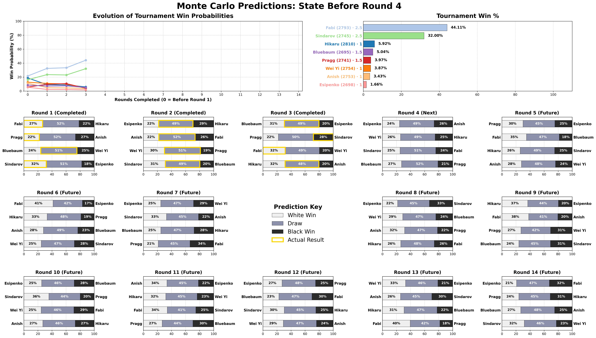

*Round 3 results: Bluebaum–Esipenko drew, Sindarov beat Pragg, Fabi beat Wei Yi, Hikaru–Anish drew*

- ✓ **Bluebaum–Esipenko drew**: draw predicted at 49.2%; correct prediction
- ✓ **Hikaru–Anish drew**: draw predicted at 47.9%; correct prediction
- ✗ **Fabi beat Wei Yi**: draw predicted at 48.8%; Fabi won; the model correctly placed Fabi's winning chances (31.6%) above Wei Yi's (19.6%)
- ✗ **Sindarov beat Pragg**: draw predicted at 49.8%; Sindarov won; the model correctly placed Sindarov's winning chances (28.1%) above Pragg's (22.1%)
- Win probs surged for both winners: Fabi jumped to **44.1%** (from 33.3%), Sindarov climbed to **32.0%** (from 23.0%); Fabi led despite equal standing, and the model weighed opponent quality

*Round 4 predictions:*
- Esipenko–Anish: 24.3% / **49.2%** / 26.5%, draw most likely; Anish with slight win edge
- Wei Yi–Hikaru: 25.8% / **49.3%** / 24.9%, draw most likely; essentially even
- Sindarov–Fabi: 25.2% / **50.8%** / 24.0%, draw most likely; essentially even; the key clash between the top two
- Bluebaum–Pragg: 27.2% / **51.9%** / 20.9%, draw most likely; Bluebaum with higher winning chances

</details>

<details>
<summary>Round 3</summary>

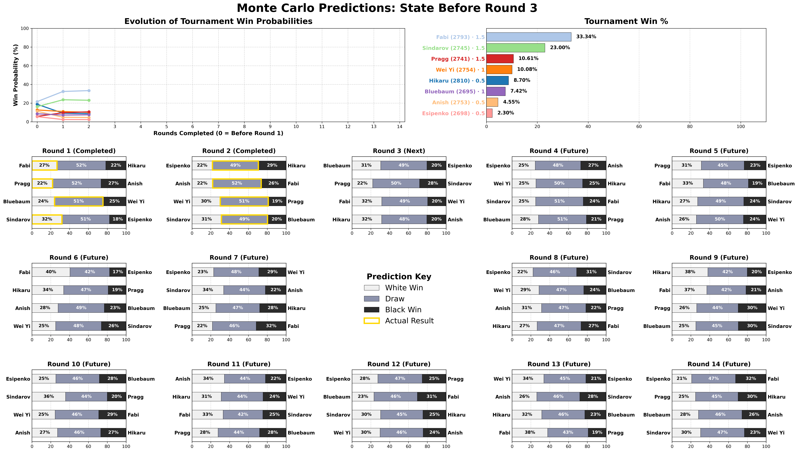

*Round 2 results: ALL FOUR games drew: Esipenko–Hikaru, Anish–Fabi, Wei Yi–Pragg, Sindarov–Bluebaum*

- ✓ **Esipenko–Hikaru drew**: draw predicted at 48.8%; correct prediction
- ✓ **Anish–Fabi drew**: draw predicted at 51.6%; correct prediction
- ✓ **Wei Yi–Pragg drew**: draw predicted at 50.9%; correct prediction
- ✓ **Sindarov–Bluebaum drew**: draw predicted at 49.0%; correct prediction
- Win probs barely shifted after four draws: Fabi held at **33.3%** (from 32.4%), Sindarov slipped to **23.0%** (from 23.5%), Pragg ticked up to **10.6%** (from 9.7%)

*Round 3 predictions:*
- Bluebaum–Esipenko: 30.5% / **49.2%** / 20.3%, draw most likely; Bluebaum with higher winning chances; Esipenko's R1 loss widened the rating gap
- Pragg–Sindarov: 22.1% / **49.8%** / 28.1%, draw most likely; Sindarov with higher winning chances as his R1 win carries forward
- Fabi–Wei Yi: 31.6% / **48.8%** / 19.6%, draw most likely; Fabi with higher winning chances as the pre-tournament front-runner
- Hikaru–Anish: 31.6% / **47.9%** / 20.5%, draw most likely; Hikaru with higher winning chances as White despite R1 loss

</details>

<details>
<summary>Round 2</summary>

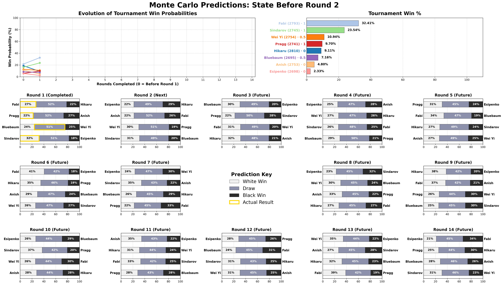

*Round 1 results: Fabi beat Hikaru, Sindarov beat Esipenko, Pragg beat Anish, Bluebaum–Wei Yi drew*

- ✗ **Fabi beat Hikaru**: draw predicted at 51.9%; Fabi won; the model correctly placed Fabi's winning chances (26.5%) above Hikaru's (21.5%)
- ✗ **Sindarov beat Esipenko**: draw predicted at 50.5%; Sindarov won; the model correctly placed Sindarov's winning chances (31.8%) above Esipenko's (17.7%)
- ✓ **Bluebaum–Wei Yi drew**: draw predicted at 51.5%; correct prediction
- ✗ **Pragg beat Anish**: draw predicted at 51.6%; Pragg won despite Anish having higher winning chances (26.5% vs 21.9%); wrong direction
- All three R1 winners jumped sharply: Fabi 21.5% → **32.4%**, Sindarov 16.1% → **23.5%**, Pragg 5.7% → **9.7%**; strong priors still amplified single-game results immediately

*Round 2 predictions:*
- Esipenko–Hikaru: 21.7% / **48.8%** / 29.5%, draw most likely; Hikaru with higher winning chances
- Anish–Fabi: 22.0% / **51.6%** / 26.4%, draw most likely; Fabi with higher winning chances
- Wei Yi–Pragg: 30.1% / **50.9%** / 19.0%, draw most likely; Wei Yi with higher winning chances
- Sindarov–Bluebaum: 31.2% / **49.0%** / 19.8%, draw most likely; Sindarov with higher winning chances

</details>

<details>
<summary>Round 1</summary>

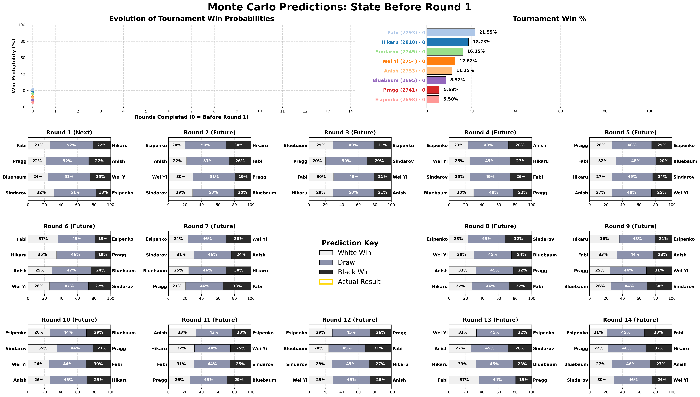

*Pre-tournament predictions*

- **Fabi** was the favourite at **21.5%**: consistent profile across all three time controls gave a stable overall estimate
- **Hikaru at 18.7%** despite the highest classical Elo (2810): flat classical trend and weaker rapid/blitz velocity
- **Sindarov at 16.1%** with only 2745 Elo: strongly rising classical trend [2721→2745, +24 pts] and improving rapid history; the model rewarded recent momentum
- **Bluebaum at 8.5%** for a 2695-rated player: positive classical trend with no drag from weak secondary time controls
- **Pragg at only 5.7%** despite his FIDE ranking: classical rating falling [2768→2741, −27 pts]; the model tracked the trend, not the name

*Round 1 predictions:*
- Fabi–Hikaru: 26.5% / **51.9%** / 21.5%, draw most likely; Fabi with higher winning chances
- Pragg–Anish: 21.9% / **51.6%** / 26.5%, draw most likely; Anish with higher winning chances
- Bluebaum–Wei Yi: 24.0% / **51.5%** / 24.5%, draw most likely; essentially even
- Sindarov–Esipenko: 31.8% / **50.5%** / 17.7%, draw most likely; Sindarov with higher winning chances

</details>

## Repository Layout

```
src/
  chess_montecarlo.cpp      Main C++ simulation engine (parametric draw model)
  chess_montecarlo_alt.cpp  Experimental variant using an ordered-logit outcome model
  json.hpp, pcg_random.hpp, pcg_extras.hpp   Third-party headers (fetched by install.sh)
bin/                        Compiled binary (chess_montecarlo)
configs/                    Hyperparameter files (tuned presets and defaults)
data/
  players.jsonc             Player registry (name, alias, FIDE ID)
  <tournament>.jsonc        Tournament definition (schedule, players, tiebreak mode)
  raw/                      Cached FIDE rating histories and Lichess PGN downloads
db/                         Optuna SQLite databases from hyperparameter tuning
results/                    Raw simulation data, one JSON per round, the source of truth
  <tournament>/             round1.json ... round{N}.json (output of generate_rounds.py)
imgs/                       Rendered images used by the README and project page
tools/
  data/
    build_tournament.py     Build tournament JSONC from a Lichess broadcast + FIDE ratings
  tuning/
    tune.py                 Optuna multi-objective hyperparameter search
    evaluate.py             Score a fixed hyperparameter set against tournament data
    pareto_front.py         Plot Optuna Pareto front and print best trials
    utils.py                Shared scoring utilities
  viz/
    generate_rounds.py      Run the C++ engine for each round, save JSON outputs → results/
    visualize_timeline.py   Render per-round dashboard PNGs from round JSONs → imgs/
    generate_html.py        Bundle template.html + viz.css + viz.js into a self-contained dashboard
    template.html           HTML shell for the interactive dashboard (CSS/JS injected at build)
    viz.css                 Styles for the interactive dashboard
    viz.js                  Chart.js logic, scenario explorer, table interactions
install.sh                  Setup: fetches json.hpp + PCG headers, compiles C++, installs Python deps
example.sh                  Full end-to-end workflow example
```

## How It Works

### The short version

Each player starts with a projected rating based on their FIDE Classical, Rapid, and Blitz histories. Before each simulated game, the model computes win/draw/loss probabilities from the two players' ratings, adjusted for who has the white pieces, how aggressively each player tends to play, and how desperate they are based on the standings. After each round, ratings are updated to reflect actual (or simulated) results. This process repeats millions of times; the fraction of simulations each player wins is their estimated win probability.

### Key model features

- **Dynamic Bayesian ratings**: per-player White/Black strength estimates updated every round via MAP inference
- **Velocity projection**: recent rating trends across Classical/Rapid/Blitz are extrapolated forward - rising players get credit, declining players get penalized
- **Parametric draw model**: draw probability depends on time control (classical games draw far more than rapid/blitz) and is scaled by player style and tournament situation
- **Style multiplier**: aggressive pairings (many decisive games historically) shrink the draw band; solid pairings inflate it
- **Standings multiplier**: players behind in the standings play more aggressively; comfortable leaders play more conservatively
- **FIDE tiebreak modes**: `fide2026` (Rapid → Blitz → Armageddon), `fide2024` (Rapid → Blitz → sudden-death Blitz), or `shared` (split probability evenly)
- **Parallel simulation**: uses all CPU cores via `std::thread`

## Build

```bash
g++ -O3 -march=native -std=c++17 -pthread src/chess_montecarlo.cpp -o bin/chess_montecarlo
```

Requires a C++17 compiler. Third-party headers (fetched into `src/` by `install.sh`):
- [`json.hpp`](https://github.com/nlohmann/json) for JSON parsing
- [`pcg_random.hpp`](https://www.pcg-random.org/) for fast, high-quality random number generation

Or use the install script, which fetches the headers, builds the binary, and sets up Python dependencies:

```bash
bash install.sh
```

## Usage

### Run the simulator

```bash
./bin/chess_montecarlo configs/best_hparams_22_24.jsonc data/candidates2026.jsonc 8 > round8.json
```

Arguments: `[hyperparameters.jsonc] [tournament.jsonc] [simulate_from_round]`. The third argument (default 1) controls which round to start simulating from - earlier rounds use actual results. Output is JSON to stdout.

Output fields:

| Field | Description |
|---|---|
| `winner_probs` | Tournament win probability per player |
| `expected_points` | Average final score per player |
| `rank_matrix` | Probability of finishing in each position |
| `game_probs` | Per-game win/draw/loss probabilities by round |

### Build tournament data from Lichess

```bash
python tools/data/build_tournament.py BLA70Vds -o data/candidates2026.jsonc
python tools/data/build_tournament.py BLA70Vds --tiebreak fide2026
python tools/data/build_tournament.py BLA70Vds --as-of 2024-04    # slice FIDE history
python tools/data/build_tournament.py BLA70Vds --no-fide           # skip FIDE fetch
```

Requires `pip install requests python-chess`.

### Run all rounds and generate visualizations

The two directories play distinct roles: **`results/`** holds raw simulation data (one JSON per round, treated as the source of truth); **`imgs/`** holds rendered visualizations derived from it. Every visualization script reads from `results/` and writes into `imgs/`.

```bash
# 1. Simulate all rounds → results/ (one JSON file per round)
python tools/viz/generate_rounds.py configs/best_hparams_22_24.jsonc data/candidates2026.jsonc results/candidates2026/

# 2. Render per-round dashboard PNGs → imgs/candidates2026/
python tools/viz/visualize_timeline.py results/candidates2026/

# 3. Generate the self-contained interactive HTML dashboard
#    (reads from results/, writes a single HTML file wherever you point --output)
python tools/viz/generate_html.py \
    --tournament data/candidates2026.jsonc \
    --rounds results/candidates2026/ \
    --hparams configs/best_hparams_22_24.jsonc \
    --db db/tuning_22_24.db \
    --output candidates2026.html
```

Requires `pip install matplotlib pandas numpy pillow`.

### Tune hyperparameters

```bash
python tools/tuning/tune.py configs/default_hparams.jsonc data/candidates2022.jsonc data/candidates2024.jsonc \
    --db db/tuning_22_24.db --trials 10000
```

Uses [Optuna](https://optuna.org) to minimize two objectives simultaneously:
1. **Weighted Game Brier Score** - how well individual game outcomes are predicted
2. **Rank RPS** - how well final tournament standings are predicted

```bash
# Visualize Pareto front
python tools/tuning/pareto_front.py db/tuning_22_24.db --save imgs/pareto/tuning_22_24.png
```

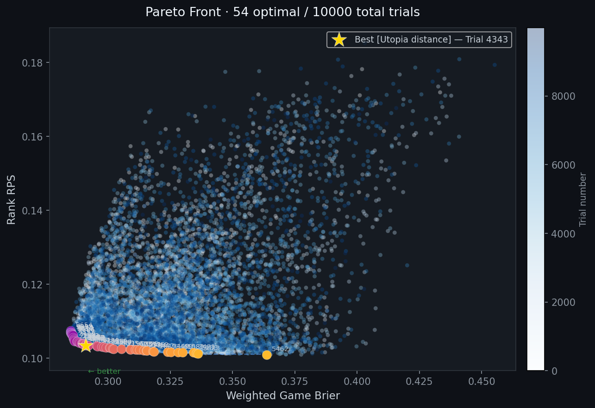

### Evaluate a parameter set

```bash
python tools/tuning/evaluate.py configs/best_hparams_22_24.jsonc data/candidates2022.jsonc data/candidates2024.jsonc
```

Reports per-round: Game Brier, Winner Brier, Points MSE, and Rank RPS.

## JSON Format

**Hyperparameters** (`configs/best_hparams_22_24.jsonc`): Key groups - simulation settings (`runs`, `map_iters`), MAP priors (`prior_weight_known/sim`), rating initialization (`initial_white_adv`, `velocity_time_decay`, `lookahead_factor`), cross-time-control blending (`rapid_form_weight`, `blitz_form_weight`, `color_bleed`), draw model (`classical_nu`, `rapid_nu`, `blitz_nu`), aggression (`agg_prior_weight`, `default_aggression_w/b`, `standings_aggression`).

**Tournament** (`data/candidates2026.jsonc`): Top-level fields - `gpr` (games per round), `tiebreak` mode, `players` array (FIDE ID, name, ratings, rating histories), `schedule` array (white/black FIDE IDs, round, optional result). Games without a `result` field are simulated.

### Tuned parameter interpretation

| Parameter | Value | What it means |
|---|---|---|
| `initial_white_adv` | 19.5 Elo | Small advantage for having the white pieces |
| `lookahead_factor` | 5.00 | Rising players get strong credit for their trend |
| `velocity_time_decay` | 0.313 | Recent form matters much more than older results |
| `classical_nu` | 2.17 | Classical games draw very often |
| `rapid_nu / blitz_nu` | 0.22 / 0.025 | Rapid and blitz are far more decisive |
| `standings_aggression` | 0.109 | Tournament position has a small effect on playing style |

## Acknowledgements

- Inspired by [Thomas Dondorf](https://github.com/thomasdondorf)'s Reddit posts on Candidates simulations.
- Tournament schedules and live results via the [Lichess broadcast API](https://lichess.org/api).
- Player ratings and rating histories via [FIDE](https://ratings.fide.com/).
- Model design and C++/Python implementation developed with help from [**Google Gemini**](https://gemini.google.com/) and [**Anthropic Claude**](https://claude.ai/).
- Interactive dashboard designed with [**Claude**](https://claude.ai/) via the [`/frontend-design`](https://github.com/anthropics/skills/blob/main/skills/frontend-design/) skill.
